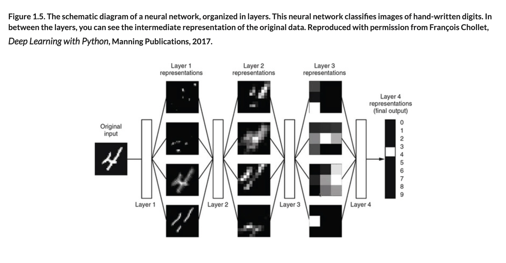

# 🌱 NNs and DL

## [**1.1.3** Neural networks and deep learning](https://livebook.manning.com/book/deep-learning-with-javascript/chapter-1/52)

---

### [**Figure 1.5** The schematic diagram of a neural network, organized in layers](https://livebook.manning.com/book/deep-learning-with-javascript/chapter-1/ch01fig05)

---

## **Vocabulary**

- [**Artificial neural networks**](https://en.wikipedia.org/wiki/Artificial_neural_network)
  - usually simply called neural networks (NNs).
  - These are computing systems vaguely inspired by the biological neural networks that constitute animal brains.
- **Layers**
  - layers are usually **stacked on top of each other** with connections only between adjacent ones.
  - A layer of neural networks is similar to **a mathematical function in that it is a mapping from an input value to an output value**.
- **Weights**
  - are a **set of numeral values that belong to the layer** and govern the details of how **each input representation is transformed by the layer** into an output representation.
- **matrix**
  - A matrix is a collection of numbers arranged into a fixed number of rows and columns.
  - Usually the numbers are real numbers.
- **vector**
  - In a computer, the layers of the neural network are represented as vectors.
  - Consider the input layer as X and the hidden layer as H. The output layer is not concerned for now.
  - Every single column of the network are vectors. Vectors are dynamic arrays that are a collection of data(or features).
- **loss function**
  - The Loss Function is one of the important components of Neural Networks.
  - Loss is nothing but a prediction error of Neural Net.
  - And the method to calculate the loss is called Loss Function.
  - In simple words, the Loss is used to calculate the gradients.
  - And gradients are used to update the weights of the Neural Net.
- **gradient descent**
- **naives bayes classifier**
- **logistic regression (logreg)**
- **kernel methods**
- **tackle binary**
- **decision trees**
- **random forests**
- **gradient**
- **Kaggle**
- **backpropagation**
- **feature engineering**
- **shallow learning**
- **deep-learning model**

## **Blogs**

- [**Yes you should understand backprop**](https://karpathy.medium.com/yes-you-should-understand-backprop-e2f06eab496b#.vt3ax2kg9)

<link rel="stylesheet" type="text/css" media="all" href="../../../assets/css/custom.css" />

---

from [[_1-1-ai-nn-dl]]

[//begin]: # "Autogenerated link references for markdown compatibility"
[_1-1-ai-nn-dl]: _1-1-ai-nn-dl.md "🌱 AI ML NN DL"
[//end]: # "Autogenerated link references"
