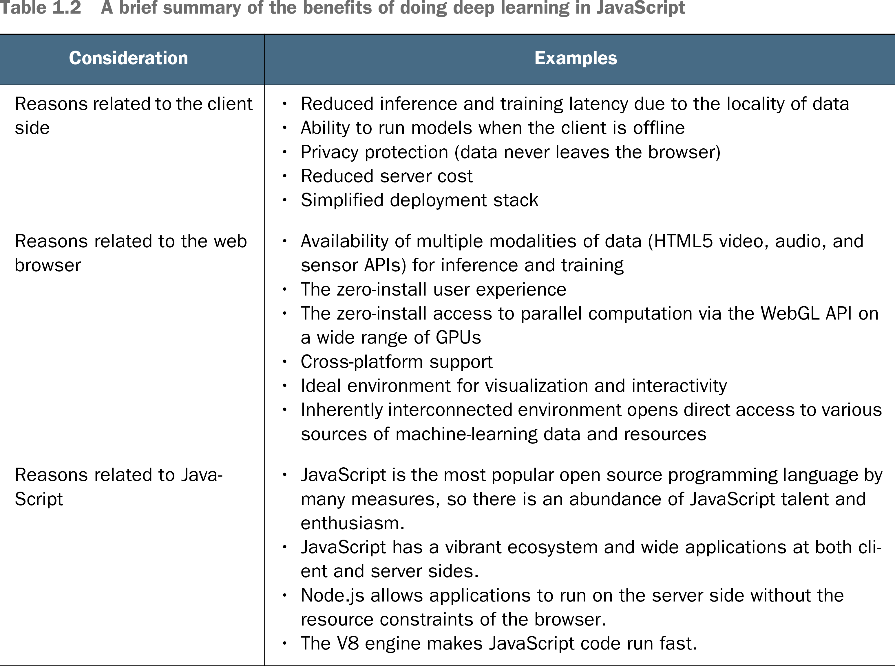

# 🌱 1.2. Why JS with ML?

## [**1.2.** Why combine JavaScript and Machine Learning?](https://livebook.manning.com/book/deep-learning-with-javascript/chapter-1/95)

---

### [**Figure 1.6.** A screenshot of TensorFlow Playground](https://livebook.manning.com/book/deep-learning-with-javascript/chapter-1/ch01fig06)

---

### [**Table 1.2** A brief summary of the benefits of doing deep learning in JavaScript](https://livebook.manning.com/book/deep-learning-with-javascript/chapter-1/ch01table02)

---

## **Vocabulary**

- <b>Deployment</b>
  - Optimizing **the speed of downloading and inference is an important factor** to the success of client-side deployment of TensorFlow.js.
- <b>access</b>
  - Browser-based application of deep learning comes with five additional benefits:
    - **reduced server cost**
    - **lowered inference latency**
    - **data privacy**
    - **instant GPU acceleration**
    - **instant access**.
- <b>deploying</b>
  - **JavaScript** and the web browser are a **suitable environment for deploying and training** deep neural networks.
  - Client-side models **lower computation on cloud GPUs**.
- <b>YOLO</b>
  - YOLO algorithm gives a much better performance on all the parameters we discussed along with a high fps for real-time usage.
  - YOLO algorithm is an algorithm based on regression, instead of selecting the interesting part of an Image, it predicts classes and bounding boxes for the whole image in one run of the Algorithm.
- <b>CNN-LSTM network</b>
  - The CNN Long Short-Term Memory Network or CNN LSTM for short is an LSTM architecture specifically designed for sequence prediction problems with spatial inputs, like images or videos.
- <b>**WebAudio API**</b>
  - The Web Audio API provides a powerful and versatile system for controlling audio on the Web, allowing developers to choose audio sources, add effects to audio, create audio visualizations, apply spatial effects.
- <b>**spoken-word recognition**</b>
  - Spoken word recognition is the study of how lexical representations are accessed from phonological patterns in the speech signal.
- <b>server cost</b>
- <b>data privacy</b>
- <b>instant access</b>
- <b>consideration</b>
- <b>Google Cloud</b>
- <b>video data</b>
- <b>Instant WebGL acceleration</b>
- <b>PyTorch</b>
- <b>PoseNet</b>
- <b>transfer learning</b>
- <b>zero install</b>
- <b>parallelization</b>
- <b>TensorFlow Playground</b>
- <b>hyperparameters</b>
- <b>embedding</b>

## Notes

- [Udacity Deep Learning - PyTorch Github](https://github.com/udacity/deep-learning-v2-pytorch)

<link rel="stylesheet" type="text/css" media="all" href="../../../assets/css/custom.css" />

---

from [[_1_dl-js]]

[//begin]: # "Autogenerated link references for markdown compatibility"
[_1_dl-js]: ../_1_dl-js.md "🌱 1 DL and JS"
[//end]: # "Autogenerated link references"
