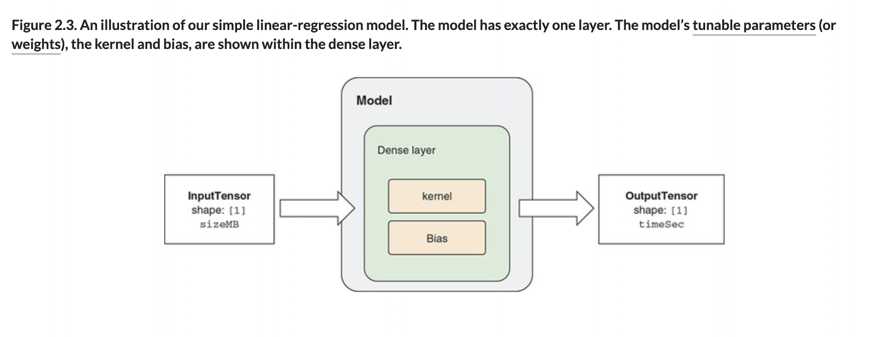

# 🪀 Def Simple Models

## [**2.1.4** Defining a simple model](https://livebook.manning.com/book/deep-learning-with-javascript/chapter-2/34)

---

### [**Figure 2.3.** An illustration of our simple linear-regression model. The model has exactly one layer. The model’s tunable parameters (or weights), the kernel and bias, are shown within the dense layer.](https://livebook.manning.com/book/deep-learning-with-javascript/chapter-2/ch02fig03)

---

## **Vocabulary**

- <b>simple model</b>
  - A linear regression model with one layer. For example a dense layers with tunable weights on the kernel and bias.
- <b>deep learning</b>
  - Deep learning (also known as deep structured learning) is part of a broader family of machine learning methods based on artificial neural networks with representation learning.
  - Learning can be supervised, semi-supervised or unsupervised.
- <b>model</b>
  - is represented by its architecture that shows how to transform two or more inputs into an output.
  - The transformation is given in the form of a learning algorithm.
- <b>regression</b>
  - Regression ANNs predict an output variable as a function of the inputs.
  - If the output variable is a categorical variable (or binary) the ANN will function as a classifier.
- <b>classification</b>
  - Classification neural networks used for feature categorization are very similar to fault-diagnosis networks, except that they only allow one output response for any input pattern, instead of allowing multiple faults to occur for a given set of operating conditions.
- <b>tunable</b>
- <b>building blocks</b>
- <b>layer</b>
- <b>dense layer</b>
- <b>kernel</b>
- <b>bias</b>
- <b>training process</b>
- <b>weights</b>
- <b>loss function</b>
- <b>learning</b>
- <b>optimizer</b>
- <b>stochastic gradient descent</b>

<link rel="stylesheet" type="text/css" media="all" href="../../../assets/css/custom.css" />

---

from [[_2-1-predict-duration-download-ts-js]]

[//begin]: # "Autogenerated link references for markdown compatibility"
[_2-1-predict-duration-download-ts-js]: _2-1-predict-duration-download-ts-js.md "🪀 Predict TF.js Download"
[//end]: # "Autogenerated link references"
