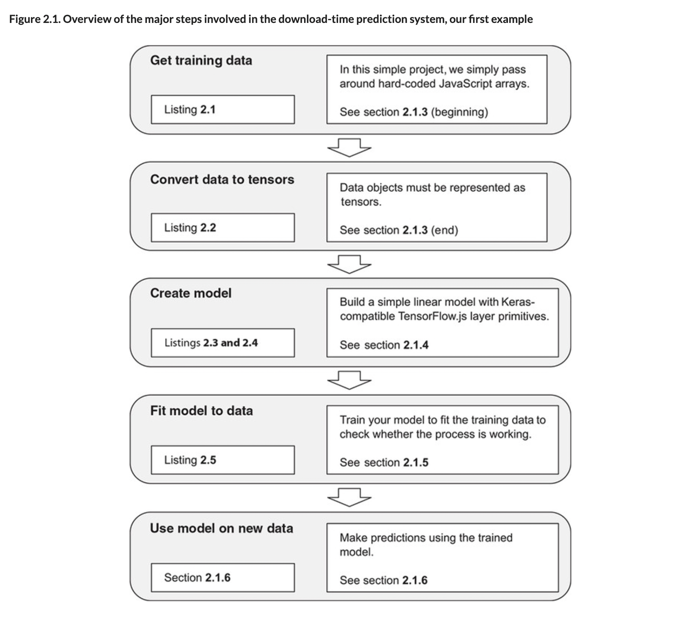

# 🪀 Predict TF.js Download

## [**2.1.** Example 1: Predicting the duration of a download using TensorFlow.js](https://livebook.manning.com/book/deep-learning-with-javascript/chapter-2/7)

---

### [**Figure 2.1.** Overview of the major steps involved in the download-time prediction system, our first example](https://livebook.manning.com/book/deep-learning-with-javascript/chapter-2/ch02fig01)

---

## **Vocabulary**

- **predicting**
  - predicting controller direction using image embeddings.
- **duration**
  - measured download duration versus file size.

<link rel="stylesheet" type="text/css" media="all" href="../../../assets/css/custom.css" />

---

from [[_2_setup-linear-regress]]

[//begin]: # "Autogenerated link references for markdown compatibility"
[_2_setup-linear-regress]: ../_2_setup-linear-regress.md "🪀 2 LINEAR REGRESS"
[//end]: # "Autogenerated link references"
