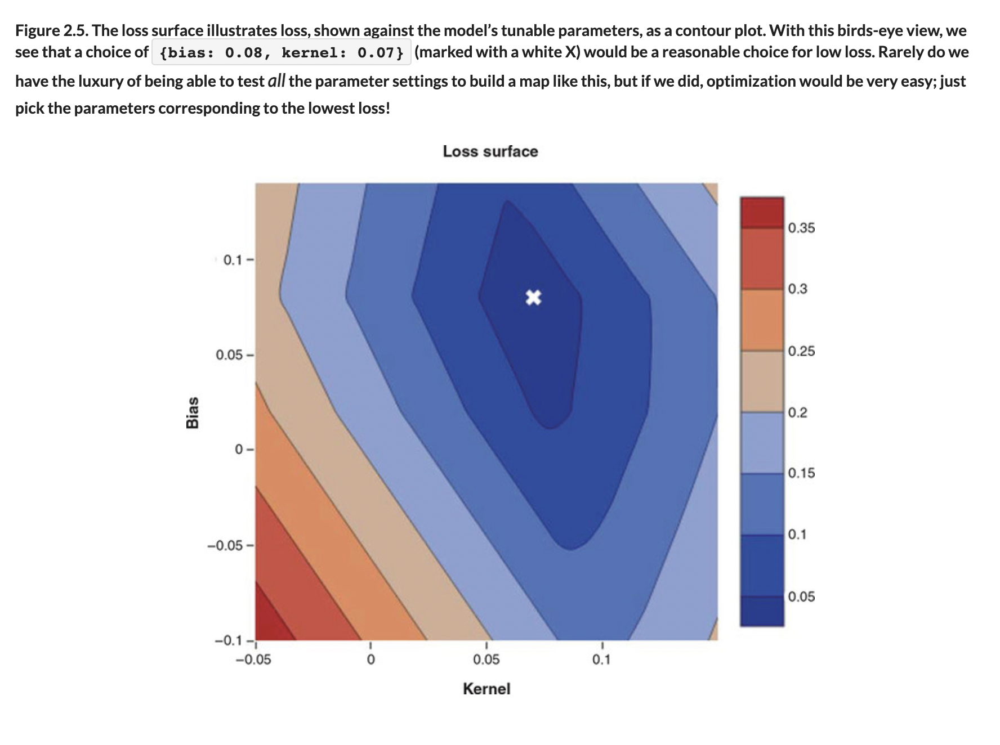
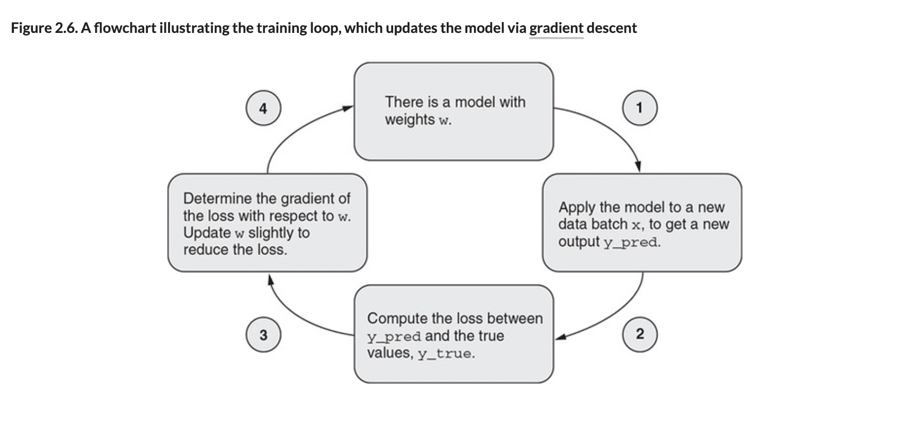
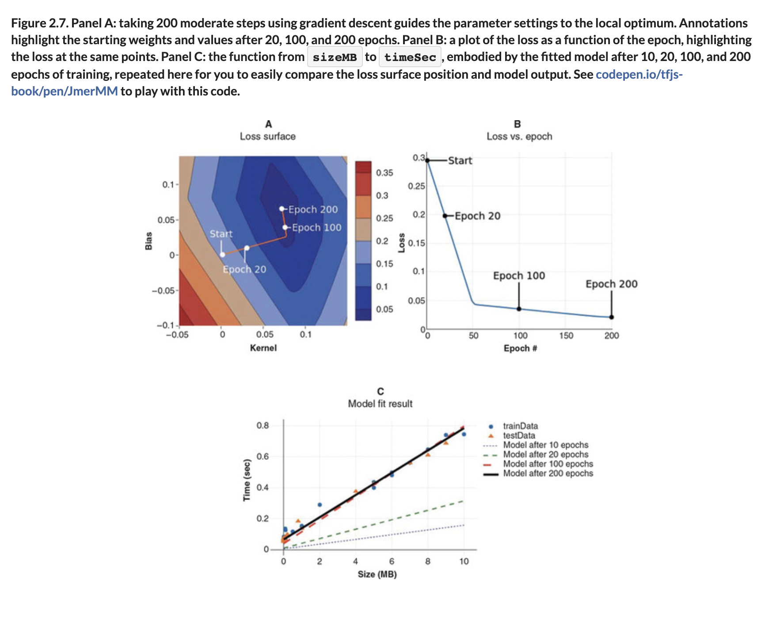
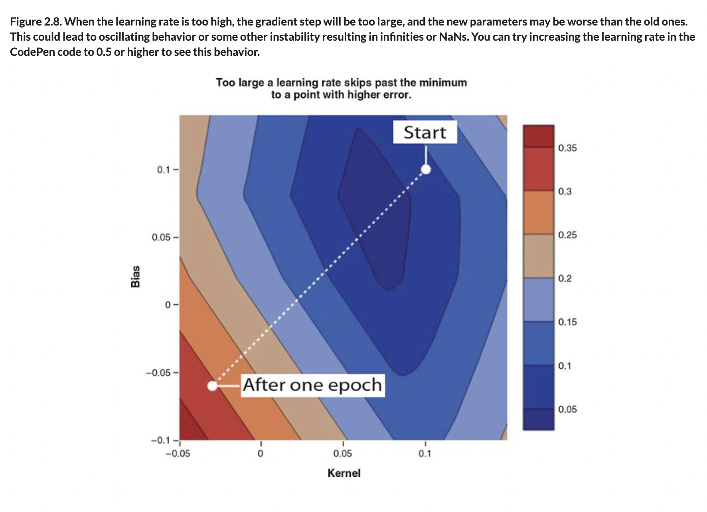

# 🪀 Intuit Gradient Optims

## [**2.2.1** The intuitions behind gradient-descent optimization](https://livebook.manning.com/book/deep-learning-with-javascript/chapter-2/96)

---

### [**Figure 2.5** The loss surface illustrates loss, shown against the model's tunable parameters, as a contour plot](https://livebook.manning.com/book/deep-learning-with-javascript/chapter-2/ch02fig05)

### [**Figure 2.6** A flowchart illustrating the training loop, which updates the model via gradient descent](https://livebook.manning.com/book/deep-learning-with-javascript/chapter-2/ch02fig06)

### [**Figure 2.7** Panel A: Gradient Descent to Epochs, Panel B: A plot of the loss as a function of epoch, Panel C: the function from sizeMB to timeSec](https://livebook.manning.com/book/deep-learning-with-javascript/chapter-2/ch02fig07)

### [**Figure 2.8** When the learning rate is too high, the gradient step will be too large, and the new parameters may be worse than the old ones](https://livebook.manning.com/book/deep-learning-with-javascript/chapter-2/ch02fig08)

---

## **Vocabulary**

- **gradient-descent optimization**
  - In optimization, a gradient method is an algorithm to solve problems of the form.
  - With the search directions defined by the gradient of the function at the current point.
  - Examples of gradient methods are the gradient descent and the conjugate gradient.
- **random initialization**
  - This serves the process of symmetry-breaking and gives much better accuracy.
  - In this method, the weights are initialized very close to zero, but randomly.
  - This helps in breaking symmetry and every neuron is no longer performing the same computation.
  - Random initialization refers to the practice of using random numbers to initialize the weights of a machine learning model.
  - Random initialization is one way of performing symmetry breaking, which is the act of preventing all of the weights in the machine learning model from being the same.
- **loss surface**
- **deep learning models**
  - Deep learning is a class of machine learning algorithms that uses multiple layers to progressively extract higher-level features from the raw input. For example, in image processing, lower layers may identify edges, while higher layers may identify the concepts relevant to a human such as digits or letters or faces.
- **training loop**
- **batch size**
- **forward pass**
- **differentiable**
- **gradient descent**
- **default learning rate**

## **Blog**

- [What do neural loss surfaces look like](https://www.youtube.com/watch?v=78vq6kgsTa8)

---

from [[_2-2-inside-model-fit]]

[//begin]: # "Autogenerated link references for markdown compatibility"
[_2-2-inside-model-fit]: _2-2-inside-model-fit.md "🪀 Inside Model Fit"
[//end]: # "Autogenerated link references"
