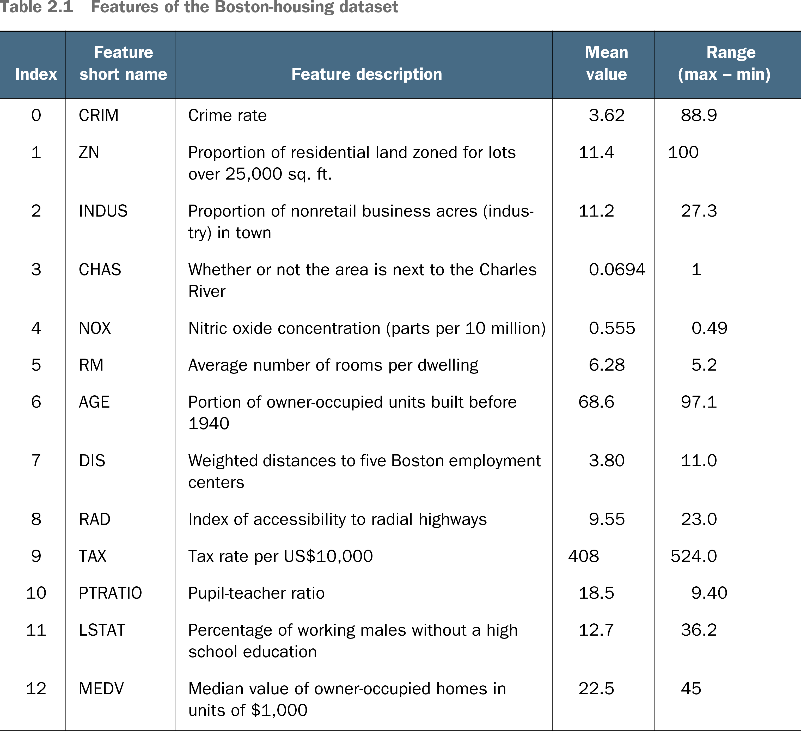

# 🪀 Housing Prices Dataset

## [**2.3.1.** The Boston Housing Prices dataset](https://livebook.manning.com/book/deep-learning-with-javascript/chapter-2/165)

---

### [**Table 2.1** Features of the Boston-housing dataset](https://livebook.manning.com/book/deep-learning-with-javascript/chapter-2/ch02table01)

---

from [[_2-3-linear-regress-multi-input-features]]

[//begin]: # "Autogenerated link references for markdown compatibility"
[_2-3-linear-regress-multi-input-features]: _2-3-linear-regress-multi-input-features.md "🪀 Linear Regress Multi-Input Features"
[//end]: # "Autogenerated link references"
