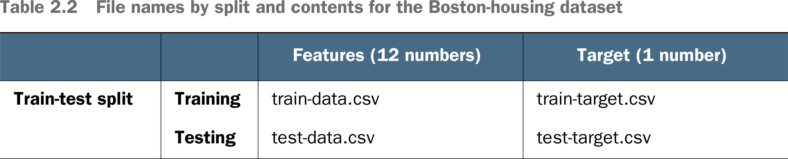

# 🪀 Accessing Data

## [**2.3.3.** Accessing the Boston-housing data](https://livebook.manning.com/book/deep-learning-with-javascript/chapter-2/192)

---

### [**Table 2.2** File names by split and contents for the Boston-housing dataset](https://livebook.manning.com/book/deep-learning-with-javascript/chapter-2/ch02table02)

---

## **Vocabulary**

- **[🔗 `tf.tensor2d`](https://js.tensorflow.org/api/0.6.1/#tensor2d)**
  - Creates **rank-2 tf.Tensor** with the provided **values, shape and dtype**.
  - The same functionality can be achieved with `tf.tensor()`.
  - In general we recommend using `tf.tensor2d()` as it **makes the code more readable**.
- <b>Google Cloud CSV</b>
  - Many existing production systems provide machine-learning-trained prediction as a service, such as Google Cloud Vision AI (https://cloud.google.com/vision) or Microsoft Cognitive Services (https://azure.microsoft.com/en-us/services/cognitive-services).
  - The end user of such a service makes HTTP requests containing the input values to the prediction, such as an image for an object-detection task, and the response encodes the output of the prediction, such as the labels and positions of objects in the image.

<link rel="stylesheet" type="text/css" media="all" href="../../../assets/css/custom.css" />

---

from [[_2-3-linear-regress-multi-input-features]]

[//begin]: # "Autogenerated link references for markdown compatibility"
[_2-3-linear-regress-multi-input-features]: _2-3-linear-regress-multi-input-features.md "🪀 Linear Regress Multi-Input Features"
[//end]: # "Autogenerated link references"
