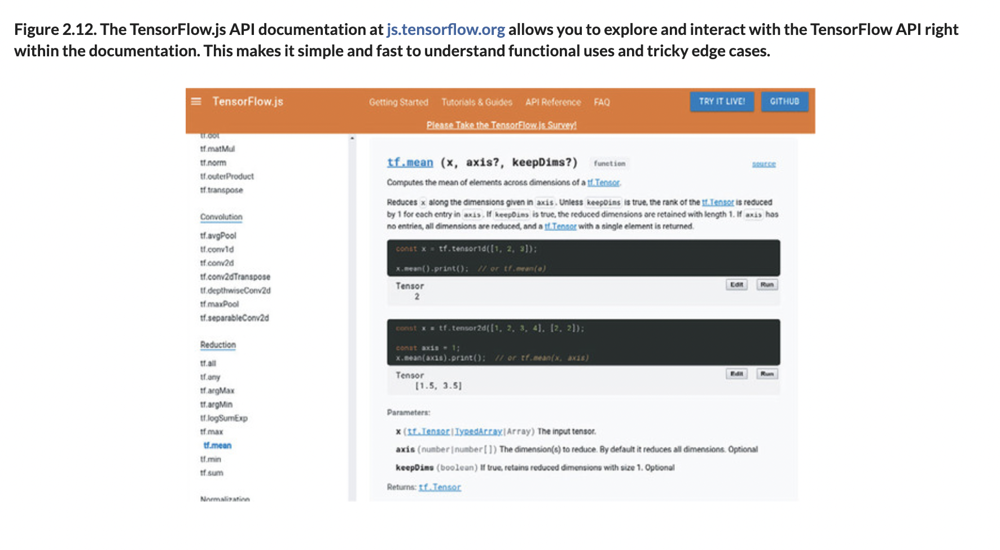

# 🪀 Data Normalization

## [**2.3.5.** A slight diversion into data normalization](https://livebook.manning.com/book/deep-learning-with-javascript/chapter-2/214)

---

### [**Figure 2.12.** The TensorFlow.js API documentation at js.tensorflow.org allows you to explore and interact with the TensorFlow API](https://livebook.manning.com/book/deep-learning-with-javascript/chapter-2/ch02fig12)

---

## **Vocabulary**

- **data normalization**
  - Batch normalization is a technique for training very deep neural networks that standardizes the inputs to a layer for each mini-batch.
  - This has the effect of stabilizing the learning process and dramatically reducing the number of training epochs required to train deep networks.
- **normalize**
- **standard transformation**
  - **z-score normalization**
- **rank-2 tensor**
- **`determineMeansAndStddev`**
- **samples**
- **feature**
- **repeating**
- **broadcast axes**

---

from [[_2-3-linear-regress-multi-input-features]]

[//begin]: # "Autogenerated link references for markdown compatibility"
[_2-3-linear-regress-multi-input-features]: _2-3-linear-regress-multi-input-features.md "🪀 Linear Regress Multi-Input Features"
[//end]: # "Autogenerated link references"
