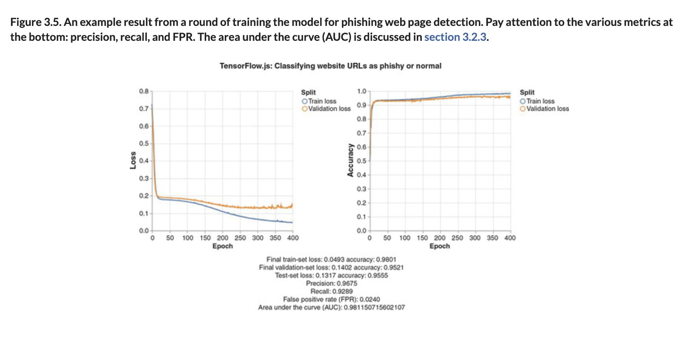
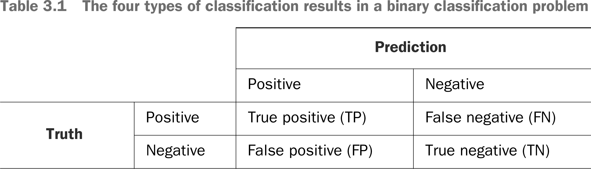

# ♒️ Measure Precision

## [**3.2.2.** Measuring the quality of binary classifiers: Precision, recall, a- accuracy, and ROC curves](https://livebook.manning.com/book/deep-learning-with-javascript/chapter-3/123)

---

### [**Figure 3.5.** An example result from a round of training the model for phishing web page detection.](https://livebook.manning.com/book/deep-learning-with-javascript/chapter-3/ch03fig05)

---

### [**Table 3.1** The four types of classification results in a binary classification problem](https://livebook.manning.com/book/deep-learning-with-javascript/chapter-3/ch03table01)

---

## **Vocabulary**

- <b>True positive (TPs)</b>
  - is an outcome where the model **correctly predicts the positive class**.
- <b>True negatives (TNs)</b>
  - is an outcome where the model **correctly predicts the negative class**.
- <b>False positives (FPs)</b>
  - is an outcome where the model **incorrectly predicts the positive class**.
- <b>False negatives (FNs)</b>
  - is an outcome where the model **incorrectly predicts the negative class**.
- <b>confusion matrix</b>
- <b>accuracy</b>
- <b>sounds</b>
- <b>precision</b>
- <b>recall</b>
  - is the ratio of actual positive examples that are classified by the model as positive.
- <b>review</b>
- <b>precision</b>
- <b>Precision at X% Recall</b>
- <b>trade-off</b>
- <b>ROC</b>

## **Blogs**

- [🔗 Classification: True vs. False and Positive vs. Negative](https://developers.google.com/machine-learning/crash-course/classification/true-false-positive-negative), _Dev Google ML Crash Course_
- [🔗 Machine Learning Metrics: The Confusion Matrix, Accuracy, Precision & Recall](https://www.youtube.com/watch?v=_y-peoToPj0), _Hello Paperspace, YouTube_

<link rel="stylesheet" type="text/css" media="all" href="../../../assets/css/custom.css" />

---

[[_3_adding-non-linearity]]

[//begin]: # "Autogenerated link references for markdown compatibility"
[_3_adding-non-linearity]: ../_3_adding-non-linearity.md "♒️ NON-LINEARITY"
[//end]: # "Autogenerated link references"
