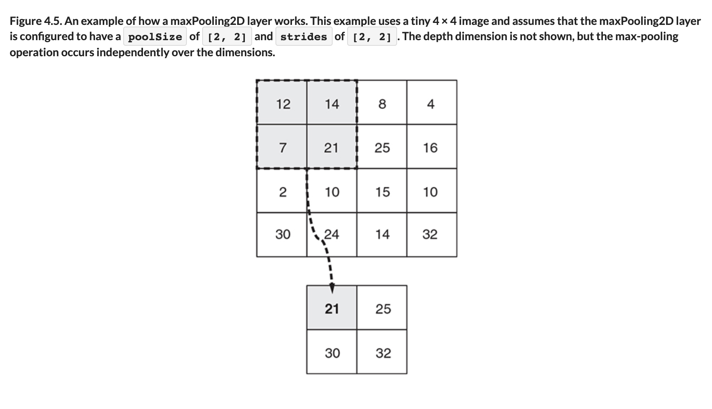

# ♦️ Max Pooling 2D Layer

## [**4.2.2** maxPooling2dlayer](https://livebook.manning.com/book/deep-learning-with-javascript/chapter-4/47)

---

### [**Figure 4.5.** An example of how a maxPooling2D layer works.](https://livebook.manning.com/book/deep-learning-with-javascript/chapter-4/ch04fig05)

---

## **Vocabulary**

- **maxPooling2d layer**
- **`pollSize`**
- **`strides`**

---

from [[_4-2-first-convnet]]

[//begin]: # "Autogenerated link references for markdown compatibility"
[_4-2-first-convnet]: _4-2-first-convnet.md "♦️ First ConvNet"
[//end]: # "Autogenerated link references"
