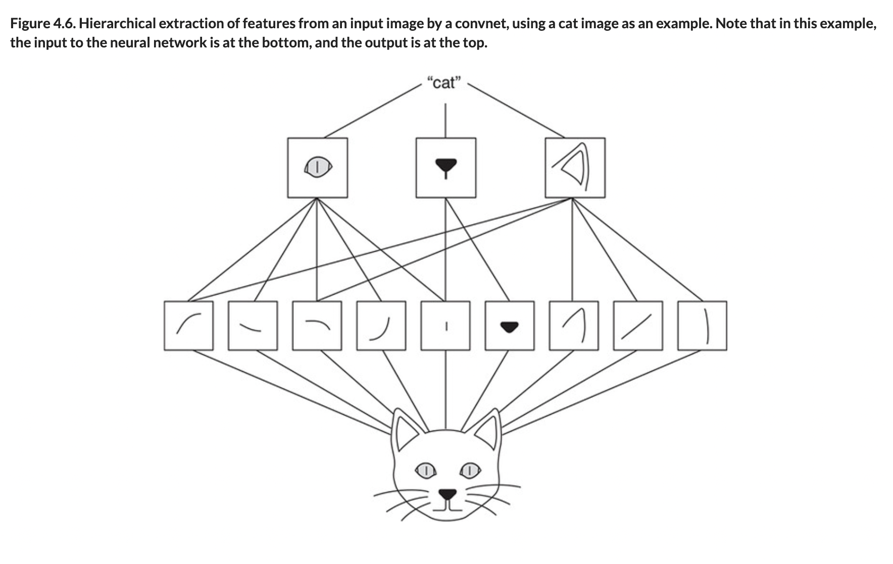

# ♦️ Conv Pooling Motifs

## [**4.2.3.** Repeating motifs of convolution and pooling](https://livebook.manning.com/book/deep-learning-with-javascript/chapter-4/55)

---

### [**Figure 4.6.** Hierarchical extraction of features from an input image by a convnet](https://livebook.manning.com/book/deep-learning-with-javascript/chapter-4/ch04fig06)

---

## **Vocabulary**

- <b>motifs</b>
- <b>convolution and pooling</b>
- <b>`inputShape`</b>
- <b>`filters`</b>

<link rel="stylesheet" type="text/css" media="all" href="../../../assets/css/custom.css" />

---

from [[_4-2-first-convnet]]

[//begin]: # "Autogenerated link references for markdown compatibility"
[_4-2-first-convnet]: _4-2-first-convnet.md "♦️ First ConvNet"
[//end]: # "Autogenerated link references"
