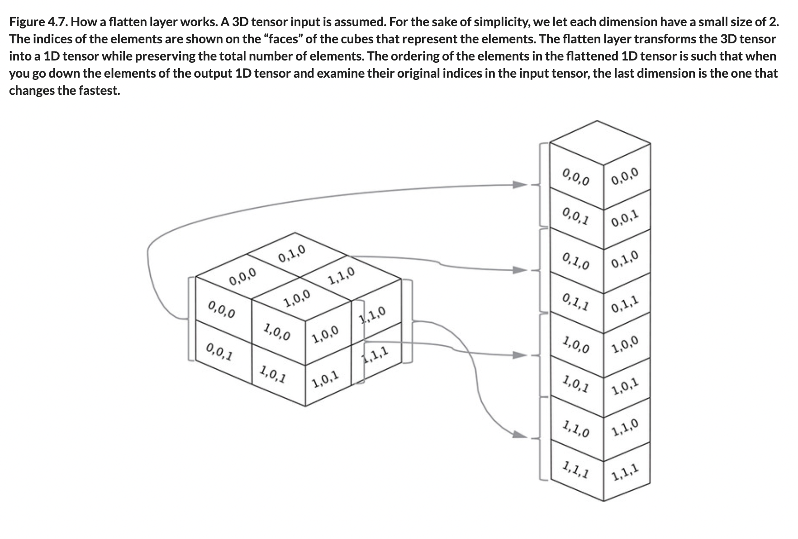

# ♦️ Flatten Dense Layers

## [**4.2.4.** Flatten and dense layers](https://livebook.manning.com/book/deep-learning-with-javascript/chapter-4/60)

---

### [**Figure 4.7.** How a flatten layer works. A 3D tensor input is assumed.](https://livebook.manning.com/book/deep-learning-with-javascript/chapter-4/ch04fig07)

---

## **Vocabulary**

- **flatten layers**
- **activation**

<link rel="stylesheet" type="text/css" media="all" href="../../../assets/css/custom.css" />

---

from [[_4-2-first-convnet]]

[//begin]: # "Autogenerated link references for markdown compatibility"
[_4-2-first-convnet]: _4-2-first-convnet.md "♦️ First ConvNet"
[//end]: # "Autogenerated link references"
