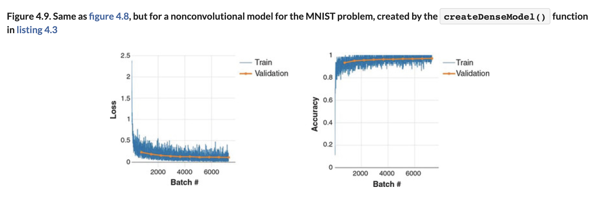

# ♦️ Training ConvNet Predict

## [**4.2.5.** Training the convnet](https://livebook.manning.com/book/deep-learning-with-javascript/chapter-4/73)

---

### [**Figure 4.9.** Same as figure 4.8, but for a non-convolutional model for the MNIST problem](https://livebook.manning.com/book/deep-learning-with-javascript/chapter-4/ch04fig09)

---

## **Vocabulary**

- <b>loss</b>
- <b>`trainData.xs`</b>
- <b>`model.fit()`</b>
- <b>loss function</b>
- <b>`categoricalCrossentropy`</b>
- <b>`model.compile()`</b>
- <b>`accuracy`</b>
- <b>`batchSize`</b>
- <b>parameter</b>
- <b>batch sizes</b>
- <b>gradient</b>
- <b>trade-off</b>
- <b>test dataset</b> - is used to measure how well the model does on previously unseen examples. It should only be used once we have tuned the parameters using the validation set.
- <b>validation dataset</b>
  - The validation dataset is used to measure how well the model does on examples that weren’t part of the training dataset. The metrics computed on the validation data can be used to tune the hyperparameters of the model. However, every time we evaluate the validation data and we make decisions based on those scores, we are leaking information from the validation data into our model. The more evaluations, the more information is leaked. So we can end up overfitting to the validation data, and once again the validation score won’t be reliable for predicting the behavior of the model in the real world.
- <b>`validationSplit`</b>
- <b>stratified cross-validation</b>
  - Cross-validation is a technique for dividing data between training and validation sets. On typical cross-validation this split is done randomly. But in stratified cross-validation, the split preserves the ratio of the categories on both the training and validation datasets.
- <b>trainData.labels</b>
- <b>overfitting</b>
- <b>supervised machine learning</b>
  - In supervised learning, we train a model to learn the relationship between input data and output data. We need to have labeled data to be able to do supervised learning.
- <b>unsupervised learning</b>
  - With unsupervised learning, we only have unlabeled data. The model learns a representation of the data. Unsupervised learning is frequently used to initialize the parameters of the model when we have a lot of unlabeled data and a small fraction of labeled data. We first train an unsupervised model and, after that, we use the weights of the model to train a supervised model.
- <b>`await`</b>
- <b>`model.evaluate`</b>
- <b>`fit()`</b>
- <b>quality</b>
- <b>random initialization</b>
- <b>convolutional layers</b>
- <b>browser</b>
- <b>classification</b>
- <b>`createConvModel`</b>
- <b>`createDenseModel`</b>

<link rel="stylesheet" type="text/css" media="all" href="../../../assets/css/custom.css" />

---

from [[_4-2-first-convnet]]

[//begin]: # "Autogenerated link references for markdown compatibility"
[_4-2-first-convnet]: _4-2-first-convnet.md "♦️ First ConvNet"
[//end]: # "Autogenerated link references"
