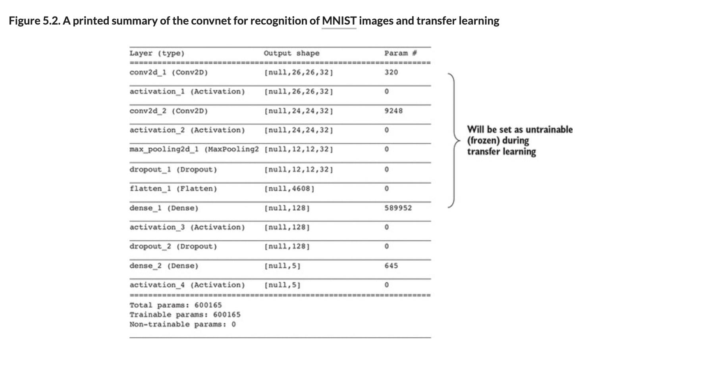
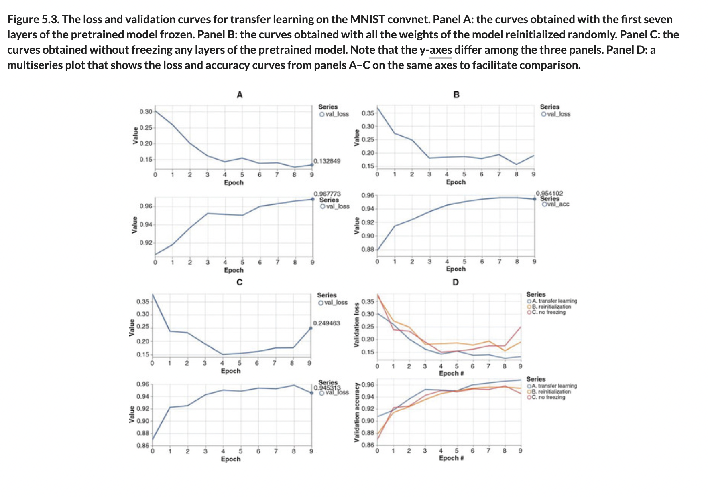
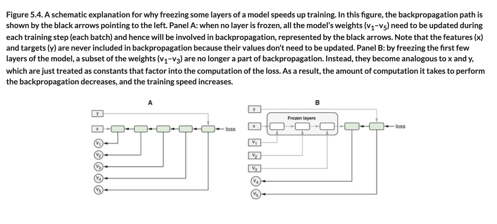

# 🟦 TL Incomp Outputs

## [**5.1.1.** Transfer learning based on compatible output shapes: Freezing layers](https://livebook.manning.com/book/deep-learning-with-javascript/chapter-5/20)

---

### [**Figure 5.2.** A printed summary of the convnet for recognition of MNIST images and transfer learning](https://livebook.manning.com/book/deep-learning-with-javascript/chapter-5/ch05fig02)

### [**Figure 5.3.** The loss and validation curves for transfer learning on the MNIST convnet.](https://livebook.manning.com/book/deep-learning-with-javascript/chapter-5/ch05fig03)

### [**Figure 5.4.** A schematic explanation for why freezing some layers of a model speeds up training.](https://livebook.manning.com/book/deep-learning-with-javascript/chapter-5/ch05fig04)

---

## **Vocabulary**

- <b>compatible output shapes</b>
- <b>freezing layers</b>
- <b>activation function</b>
- <b>softmax</b>
- <b>`retrainModel()`</b>
- <b>trainable</b>
- <b>optimizer</b>
- <b>untrainable</b>
- <b>flatten layer</b>
- <b>`trainable`</b>
- <b>`fit()`</b>
- <b>predictions</b>
- <b>gradients</b>
- <b>backpropagation</b>
- <b>layer-freezing approach</b>

<link rel="stylesheet" type="text/css" media="all" href="../../../assets/css/custom.css" />

---

from [[_5-1-intro-tl]]

[//begin]: # "Autogenerated link references for markdown compatibility"
[_5-1-intro-tl]: _5-1-intro-tl.md "🟦 Intro TL"
[//end]: # "Autogenerated link references"
