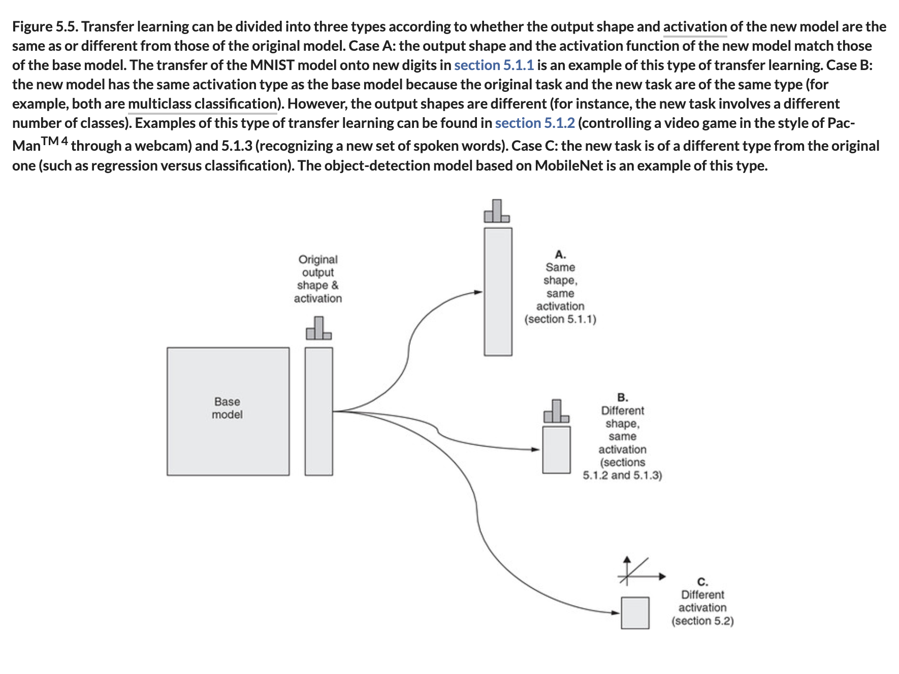
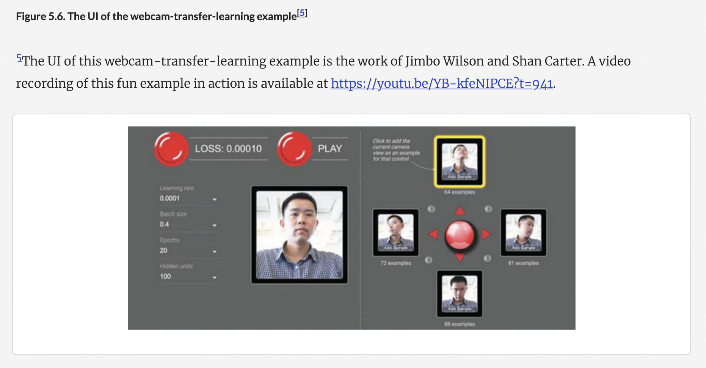
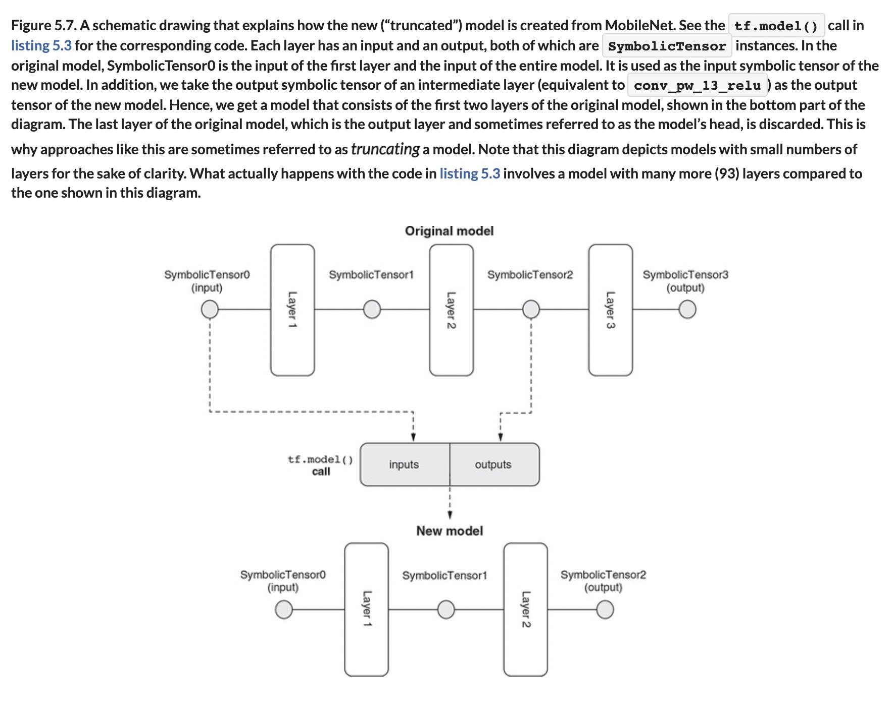
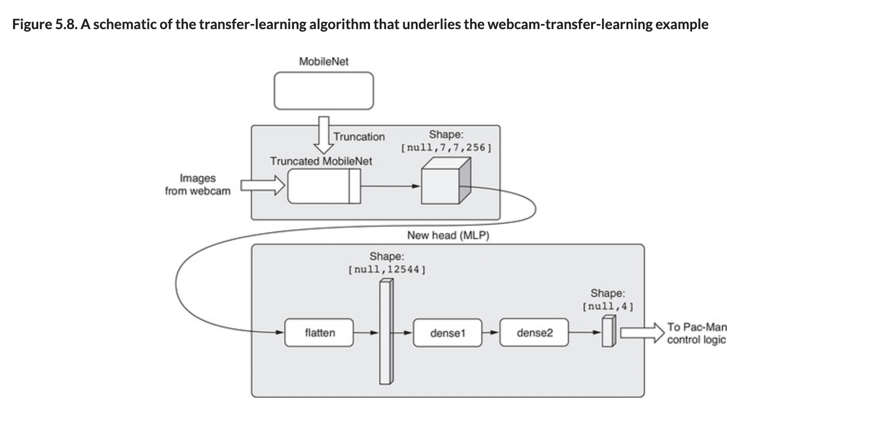

# 🟦 TL Model Output

## [**5.1.2.** Transfer learning on incompatible output shapes: Creating a new m- model using outputs fr](https://livebook.manning.com/book/deep-learning-with-javascript/chapter-5/47)

---

### [**Figure 5.5.** Transfer learning can be divided into three types according to whether the output shape and activation of the new model are the same as or different from those of the original model.](https://livebook.manning.com/book/deep-learning-with-javascript/chapter-5/ch05fig05)

### [**Figure 5.6.** The UI of the webcam-transfer-learning example](https://livebook.manning.com/book/deep-learning-with-javascript/chapter-5/ch05fig06)

### [**Figure 5.7.** A schematic drawing that explains how the new (“truncated”) model is created from MobileNet.](https://livebook.manning.com/book/deep-learning-with-javascript/chapter-5/ch05fig07)

### [**Figure 5.8.** A schematic of the transfer-learning algorithm that underlies the webcam-transfer-learning example](https://livebook.manning.com/book/deep-learning-with-javascript/chapter-5/ch05fig08)

---

## **Vocabulary**

- <b>incompatible output shapes</b>
- <b>new m-model</b>
- <b>output</b>
- <b>activation</b>
- <b>multiclass classification</b>
- <b>transfer-learning quality</b>
- <b>type</b>
- <b>predicting</b>
- <b>machine</b>
- <b>quality</b>
- <b>inference</b>
- <b>algorithm</b>
- <b>image data</b>
- <b>deep dive</b>
- <b>webcam transfer learning</b>
- <b>`SymbolicTensor`</b>
- <b>sequential</b>
- <b>graphs</b>
- <b>head</b>
- <b>truncating</b>
- <b>embeddings</b>
- <b>`controllerDataset`</b>
- <b>image tensors</b>
- <b>k-nearest neighbors</b>
- <b>artifacts</b>

<link rel="stylesheet" type="text/css" media="all" href="../../../assets/css/custom.css" />

---

from [[_5-1-intro-tl]]

[//begin]: # "Autogenerated link references for markdown compatibility"
[_5-1-intro-tl]: _5-1-intro-tl.md "🟦 Intro TL"
[//end]: # "Autogenerated link references"
