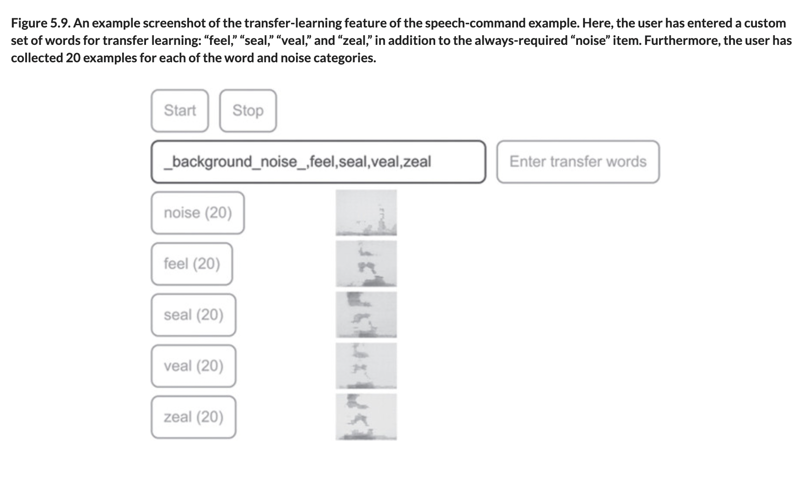
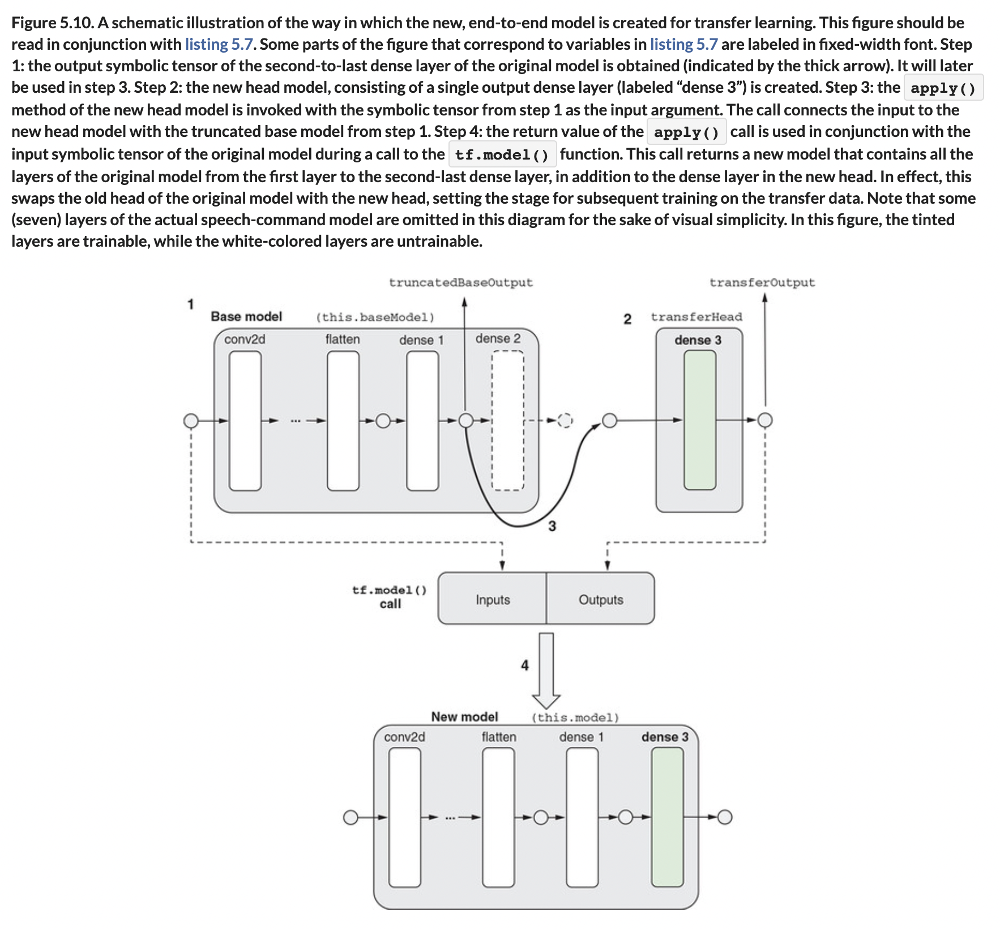
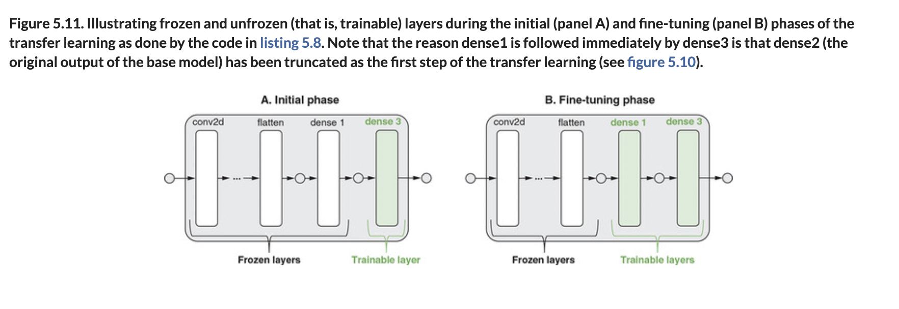
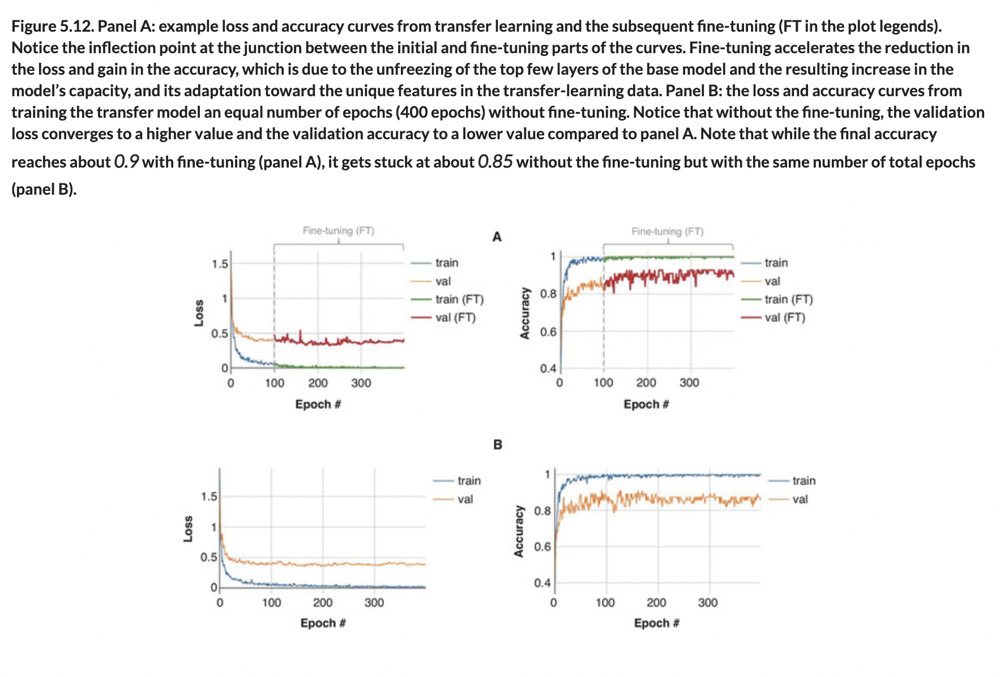

# 🟦 TL Audio Example

## [**5.1.3.** Getting the most out of transfer learning through fine-tuning: An audio example](https://livebook.manning.com/book/deep-learning-with-javascript/chapter-5/48)

---

### [**Figure 5.9.** An example screenshot of the transfer-learning feature of the speech-command example.](https://livebook.manning.com/book/deep-learning-with-javascript/chapter-5/ch05fig09)

### [**Figure 5.10.** A schematic illustration of the way in which the new, end-to-end model is created for transfer learning.](https://livebook.manning.com/book/deep-learning-with-javascript/chapter-5/ch05fig10)

### [**Figure 5.11.** Illustrating frozen and unfrozen (that is, trainable) layers during the initial (panel A) and fine-tuning (panel B) phases of the transfer learning](https://livebook.manning.com/book/deep-learning-with-javascript/chapter-5/ch05fig11)

### [**Figure 5.12.** Panel A: example loss and accuracy curves from transfer learning and the subsequent fine-tuning (FT in the plot legends).](https://livebook.manning.com/book/deep-learning-with-javascript/chapter-5/ch05fig12)

---

## **Vocabulary**

- <b>spectrogram</b>
- <b>trained model</b>
- <b>underfitting</b>
- <b>overfitting</b>
- <b>fine-tuning in transfer learning</b>
- <b>`trancatedBaseOutput`</b>
- <b>TypeScript</b>
- <b>`tf.SymbolicTensor`</b>
- <b>`trainable`</b>
- <b>attribute</b>
- <b>`balancedTrainValSplit`</b>
- <b>training subset</b>

<link rel="stylesheet" type="text/css" media="all" href="../../../assets/css/custom.css" />

---

from [[_5-1-intro-tl]]

[//begin]: # "Autogenerated link references for markdown compatibility"
[_5-1-intro-tl]: _5-1-intro-tl.md "🟦 Intro TL"
[//end]: # "Autogenerated link references"
