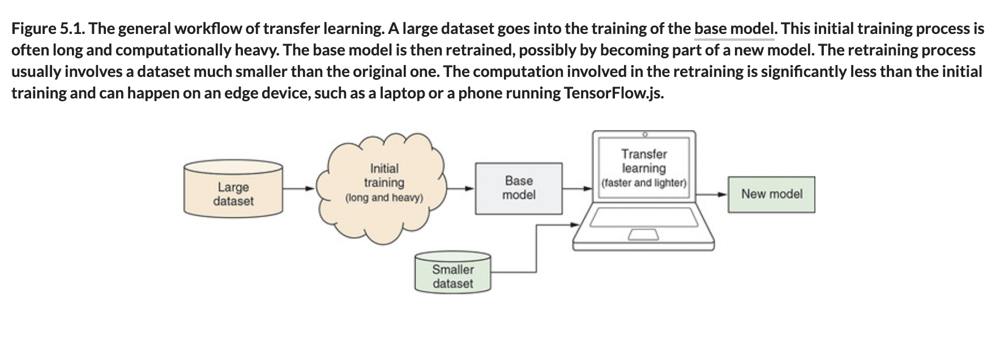

# 🟦 Intro TL

## [**5.1.** Introduction to transfer learning: Reusing pretrained models](https://livebook.manning.com/book/deep-learning-with-javascript/chapter-5/)

---

### [**Figure 5.1.** The general workflow of transfer learning. A large dataset goes into the training of the base model.](https://livebook.manning.com/book/deep-learning-with-javascript/chapter-5/ch05fig01)

---

## **Vocabulary**

- <b>dataset</b>
- <b>different but related</b>
- <b>base model</b>
- <b>retraining</b>
- <b>transfer model</b>
- <b>browser</b>
- <b>data</b>
- <b>model adaptation</b>
- <b>regression</b>
- <b>weights</b>
- <b>accuracy</b>
- <b>neural network</b>
- <b>features</b>
- <b>ImageNet</b>
- <b>deep</b>
- <b>ResNet</b>
- <b>word embeddings</b>
- <b>vector</b>
- <b>text</b>

<link rel="stylesheet" type="text/css" media="all" href="../../../assets/css/custom.css" />

---

from [[_5_transfer-learning]]

[//begin]: # "Autogenerated link references for markdown compatibility"
[_5_transfer-learning]: ../_5_transfer-learning.md "🟦 TRANSFER LEARNING"
[//end]: # "Autogenerated link references"
