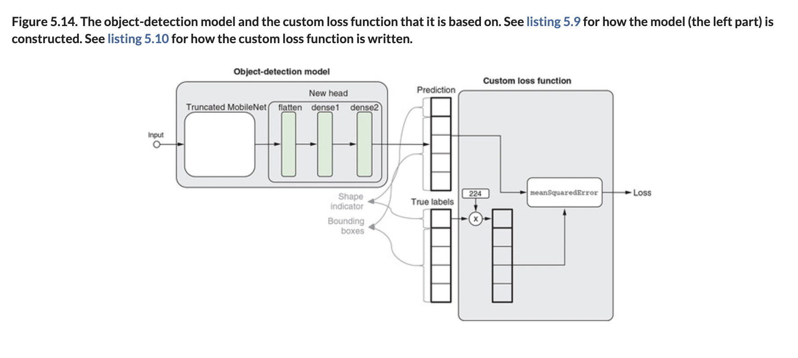

# 🟦 Simple Object Detect

## [**5.2.2.** Deep dive into simple object detection](https://livebook.manning.com/book/deep-learning-with-javascript/chapter-5/178)

---

### [**Figure 5.14.** The object-detection model and the custom loss function that it is based on.](https://livebook.manning.com/book/deep-learning-with-javascript/chapter-5/ch05fig14)

---

## **Vocabulary**

- **convolutional layers**
- **`loadTruncatedBase()`**
- **`buildNewHead()`**
- **`meanSquaredError`**
- **2D Tensor**
- **batch size**
- **scalar tensor**
- **`customLossFunction`**
- **matrix**
- **binary cross entropy**
- **hyperparameter**
- **single-shot detection (ssd)**
- **`meanAbsoluteError`**

<link rel="stylesheet" type="text/css" media="all" href="../../../assets/css/custom.css" />

---

from [[_5-2-object-detect-tl-convnet]]

[//begin]: # "Autogenerated link references for markdown compatibility"
[_5-2-object-detect-tl-convnet]: _5-2-object-detect-tl-convnet.md "🟦 Object Detect TL ConvNet"
[//end]: # "Autogenerated link references"
