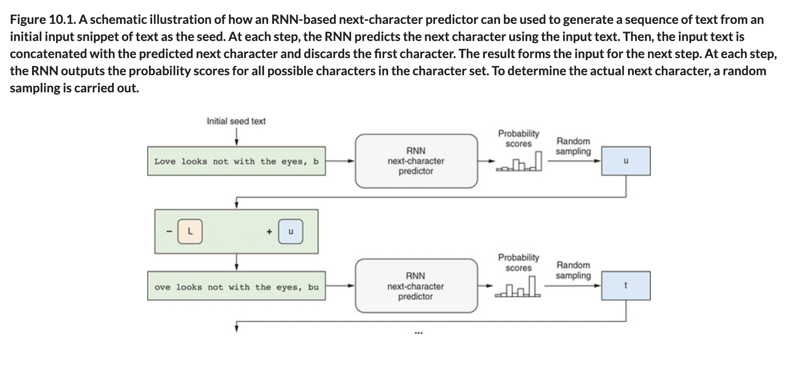

# 🦋 Next Char Predictor

## [**10.1.1.** Next-character predictor: A simple way to generate text]()

---

### [**Figure 10.1.** A schematic illustration of how an RNN-based next-character predictor can be used to generate a sequence of text from an initial input snippet of text as the seed.](https://livebook.manning.com/book/deep-learning-with-javascript/chapter-10/ch10fig01)

---

## **Vocabulary**

- <b>next-character predictor</b>
- <b>sequence based classification</b>
- <b>sentiment analysis</b>
- <b>Claude Shannon</b>
- <b>entropy</b>

<link rel="stylesheet" type="text/css" media="all" href="../../../assets/css/custom.css" />

---

from [[_10-1-gen-text-lstm]]

[//begin]: # "Autogenerated link references for markdown compatibility"
[_10-1-gen-text-lstm]: _10-1-gen-text-lstm.md "🦋 Gen Text LSTM"
[//end]: # "Autogenerated link references"
