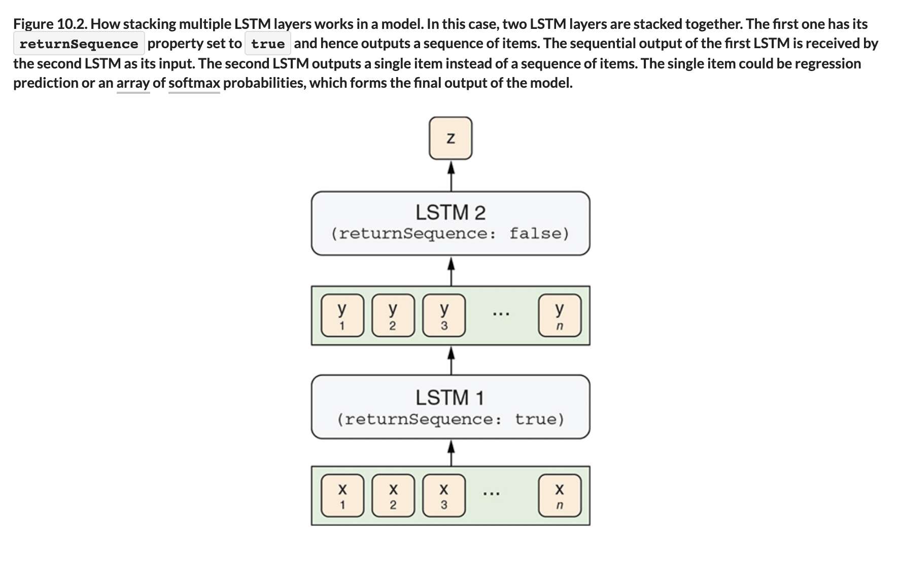

# 🦋 LSTM Text Gene

## [**10.1.2.** The LSTM-text-generation example]()

---

### [**Figure 10.2.** How stacking multiple LSTM layers works in a model.](https://livebook.manning.com/book/deep-learning-with-javascript/chapter-10/ch10fig02)

---

## **Vocabulary**

- **LSTM text generation**
- **`returnSequence`**
- **sequential**
- **dense layers**
- **`lstmLayerSize`**
- **`sampleLen`**
- **`charSetSize`**
- **batch dimension**
- **categorical cross-entropy loss**
- **optimizer**
- **RMSProp**
- **hyperparameters**
- **temperature values**

---

from [[_10-1-gen-text-lstm]]

[//begin]: # "Autogenerated link references for markdown compatibility"
[_10-1-gen-text-lstm]: _10-1-gen-text-lstm.md "🦋 Gen Text LSTM"
[//end]: # "Autogenerated link references"
