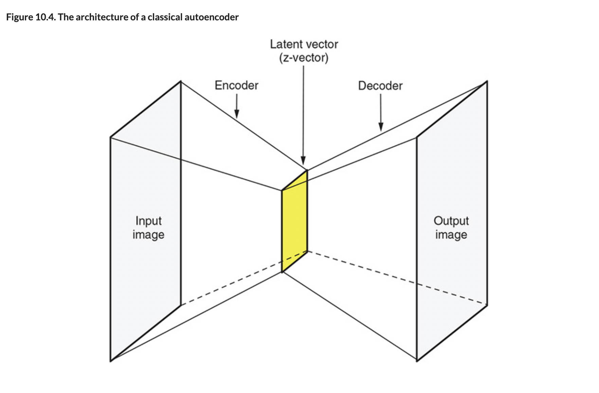
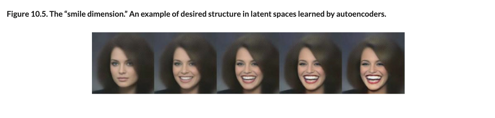
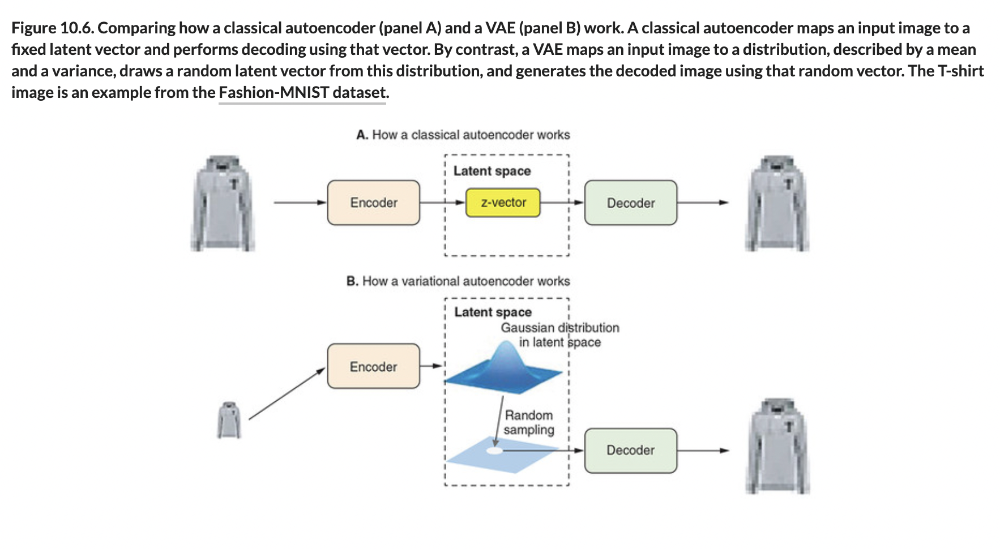

# 🦋 Classical Auto Enc

## [**10.2.1.** Classical autoencoder and VAE: Basic ideas](https://livebook.manning.com/book/deep-learning-with-javascript/chapter-10/72)

---

### [**Figure 10.4.** The architecture of a classical autoencoder](https://livebook.manning.com/book/deep-learning-with-javascript/chapter-10/ch10fig04)

### [**Figure 10.5.** The “smile dimension.” An example of desired structure in latent spaces learned by autoencoders.](https://livebook.manning.com/book/deep-learning-with-javascript/chapter-10/ch10fig05)

### [**Figure 10.6.** Comparing how a classical autoencoder (panel A) and a VAE (panel B) work.](https://livebook.manning.com/book/deep-learning-with-javascript/chapter-10/ch10fig06)

---

## **Vocabulary**

- <b>classical autoencoder</b>
- <b>basic ideas</b>
- <b>loss function</b>
- <b>image-to-image transformation</b>
- <b>z-vector</b>
- <b>encoder</b>
- <b>decoder</b>
- <b>latent vector</b>
- <b>classical autoencoders</b>

<link rel="stylesheet" type="text/css" media="all" href="../../../assets/css/custom.css" />

---

from [[_10-2-var-auto-enc]]

[//begin]: # "Autogenerated link references for markdown compatibility"
[_10-2-var-auto-enc]: _10-2-var-auto-enc.md "🦋 Var Auto Enc"
[//end]: # "Autogenerated link references"
