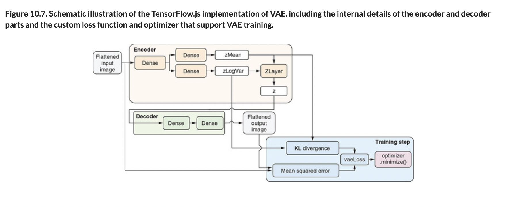

# 🦋 VAE Fashion MNIST

## [**10.2.2.** A detailed example of VAE: The Fashion-MNIST example](https://livebook.manning.com/book/deep-learning-with-javascript/chapter-10/27)

---

### [**Figure 10.7.** Schematic illustration of the TensorFlow.js implementation of VAE, including the internal details of the encoder and decoder parts and the custom loss function and optimizer that support VAE training.](https://livebook.manning.com/book/deep-learning-with-javascript/chapter-10/ch10fig07)

### [**Figure 10.8.** Sampling the latent space of the VAE after training.](https://livebook.manning.com/book/deep-learning-with-javascript/chapter-10/ch10fig08)

---

## **Vocabulary**

- <b>`zLogVar`</b>
- <b>`epsilon`</b>
- <b>`reparameterization`</b>
- <b>`computeOutputShape`</b>
- <b>output shape</b>
- <b>`call()`</b>
- <b>`ZLayer`</b>
- <b>`zMean`</b>
- <b>`k1Loss`</b>
- <b>regularization</b>
- <b>`tf.train.adam()`</b>
- <b>`fitDataset()`</b>
- <b>`minimize()`</b>
- <b>gradients</b>

<link rel="stylesheet" type="text/css" media="all" href="../../../assets/css/custom.css" />

---

from [[_10-2-var-auto-enc]]

[//begin]: # "Autogenerated link references for markdown compatibility"
[_10-2-var-auto-enc]: _10-2-var-auto-enc.md "🦋 Var Auto Enc"
[//end]: # "Autogenerated link references"
