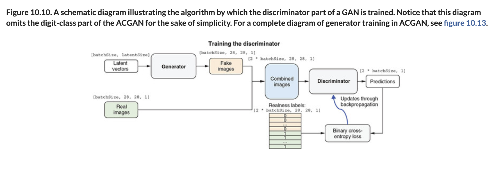
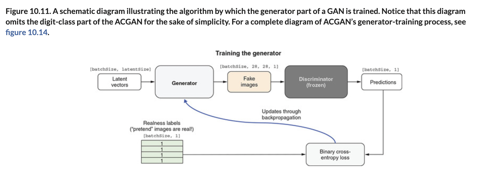

# 🦋 Basic GANs

## [**10.3.1.** The basic idea behind GANs](https://livebook.manning.com/book/deep-learning-with-javascript/chapter-10/137)

---

### [**Figure 10.10.** A schematic diagram illustrating the algorithm by which the discriminator part of a GAN is trained.](https://livebook.manning.com/book/deep-learning-with-javascript/chapter-10/ch10fig10)

### [**Figure 10.11.** A schematic diagram illustrating the algorithm by which the generator part of a GAN is trained.](https://livebook.manning.com/book/deep-learning-with-javascript/chapter-10/ch10fig11)

---

## **Vocabulary**

- **generator**
- **discriminator**
- **1D Tensor**
- **`latentSize`**
- **`batchSize`**
- **backpropagation**
- **labels**
- **MINST**
- **transfer learning**

<link rel="stylesheet" type="text/css" media="all" href="../../../assets/css/custom.css" />

---

from [[_10-3-img-gen-gans]]

[//begin]: # "Autogenerated link references for markdown compatibility"
[_10-3-img-gen-gans]: _10-3-img-gen-gans.md "🦋 Img Gen GANs"
[//end]: # "Autogenerated link references"
