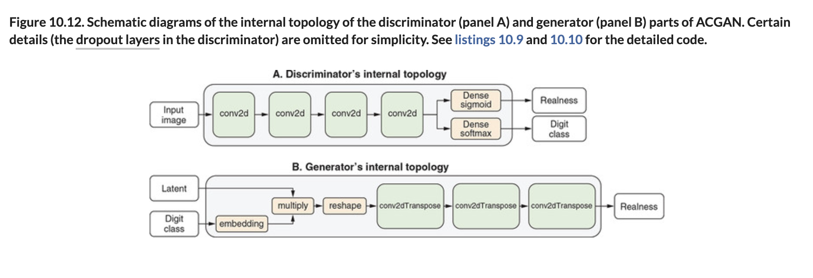

# 🦋 ACGAN

## [**10.3.2.** The building blocks of ACGAN](https://livebook.manning.com/book/deep-learning-with-javascript/chapter-10/147)

---

### [**Figure 10.12.** Schematic diagrams of the internal topology of the discriminator (panel A) and generator (panel B) parts of ACGAN.](https://livebook.manning.com/book/deep-learning-with-javascript/chapter-10/ch10fig12)

---

## **Vocabulary**

- <b>building blocks</b>
- **latent vector**
- **embedding layer**
  **`imageClass`**
- **image tensors**
- **`kernelSize`**

<link rel="stylesheet" type="text/css" media="all" href="../../../assets/css/custom.css" />

---

from [[_10-3-img-gen-gans]]

[//begin]: # "Autogenerated link references for markdown compatibility"
[_10-3-img-gen-gans]: _10-3-img-gen-gans.md "🦋 Img Gen GANs"
[//end]: # "Autogenerated link references"
