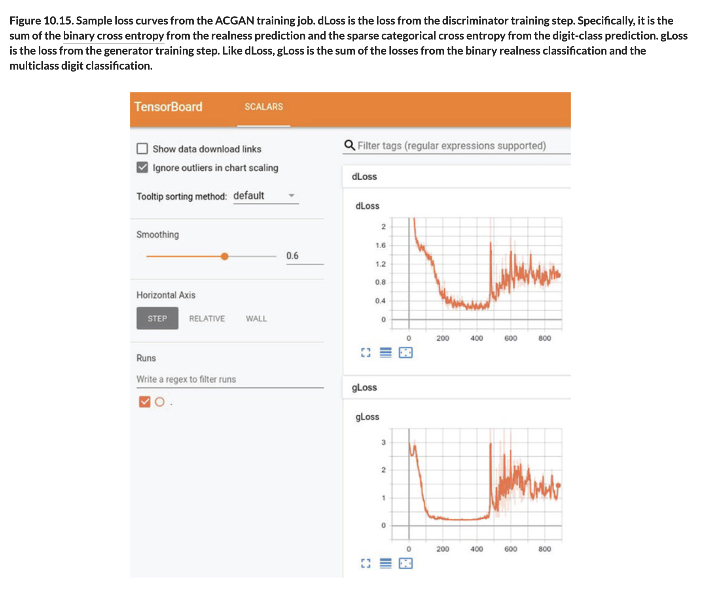
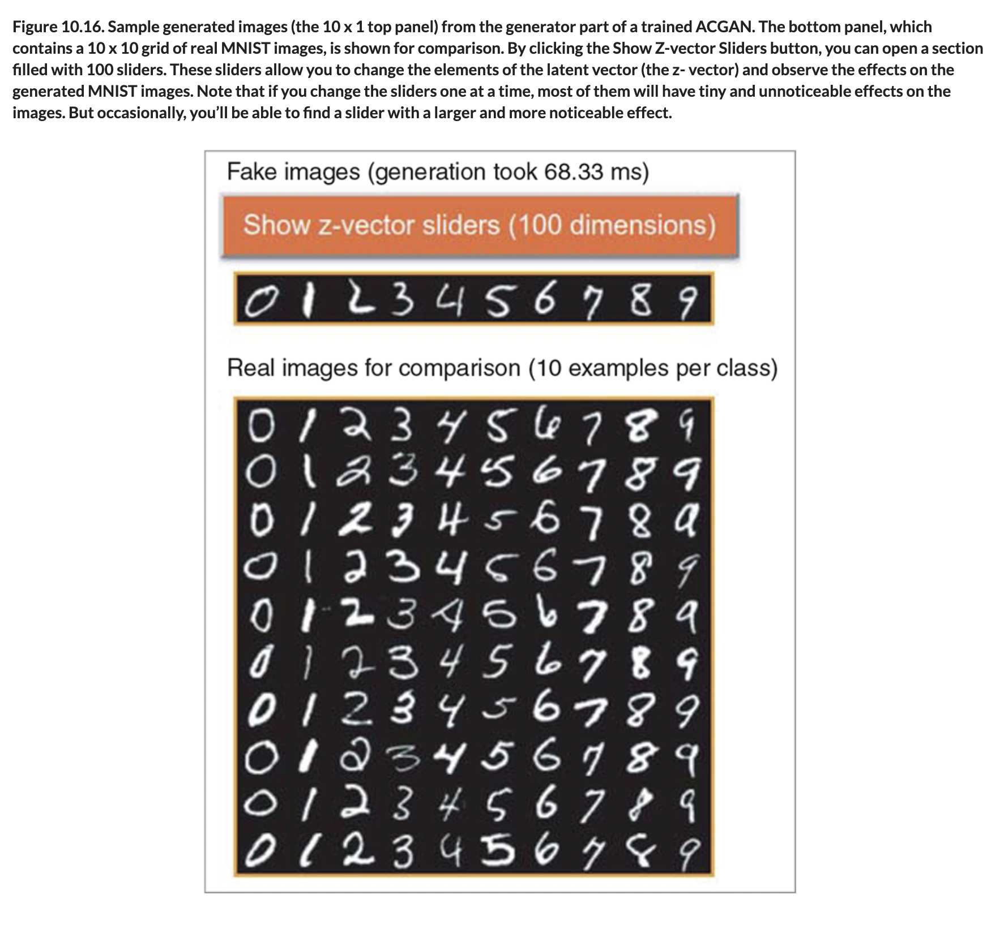

# 🦋 MNIST ACGAN Train Gen

## [**10.3.4.** Seeing the MNIST ACGAN training and generation](https://livebook.manning.com/book/deep-learning-with-javascript/chapter-10/170)

---

### [**Figure 10.15.** Sample loss curves from the ACGAN training job. dLoss is the loss from the discriminator training step.](https://livebook.manning.com/book/deep-learning-with-javascript/chapter-10/ch10fig15)

### [**Figure 10.16.** Sample generated images (the 10 x 1 top panel) from the generator part of a trained ACGAN.](https://livebook.manning.com/book/deep-learning-with-javascript/chapter-10/ch10fig16)

---

## **Vocabulary**

- <b>training and generation</b>
- <b>tensorboard url</b>
- <b>feature</b>
- <b>trend</b>
- <b>binary cross entropy</b>
- <b>`tf.concat()`</b>

<link rel="stylesheet" type="text/css" media="all" href="../../../assets/css/custom.css" />

---

from [[_10-3-img-gen-gans]]

[//begin]: # "Autogenerated link references for markdown compatibility"
[_10-3-img-gen-gans]: _10-3-img-gen-gans.md "🦋 Img Gen GANs"
[//end]: # "Autogenerated link references"
