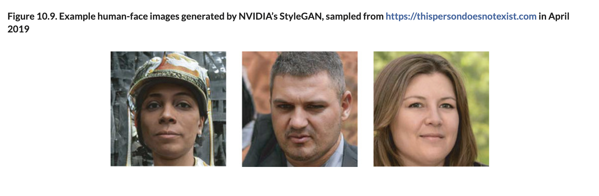

# 🦋 Img Gen GANs

## [**10.3.** Image generation with GANs](https://livebook.manning.com/book/deep-learning-with-javascript/chapter-10/126)

---

### [**Figure 10.9.** Example human-face images generated by NVIDIA’s StyleGAN](https://livebook.manning.com/book/deep-learning-with-javascript/chapter-10/ch10fig09)

---

## **Vocabulary**

- <b>StyleGAN</b>
- **artifacts**
- **ACGAN**
- **digit class**

<link rel="stylesheet" type="text/css" media="all" href="../../../assets/css/custom.css" />

---

from [[_10_gen-dl]]

[//begin]: # "Autogenerated link references for markdown compatibility"
[_10_gen-dl]: ../_10_gen-dl.md "🦋 Generative DL"
[//end]: # "Autogenerated link references"
