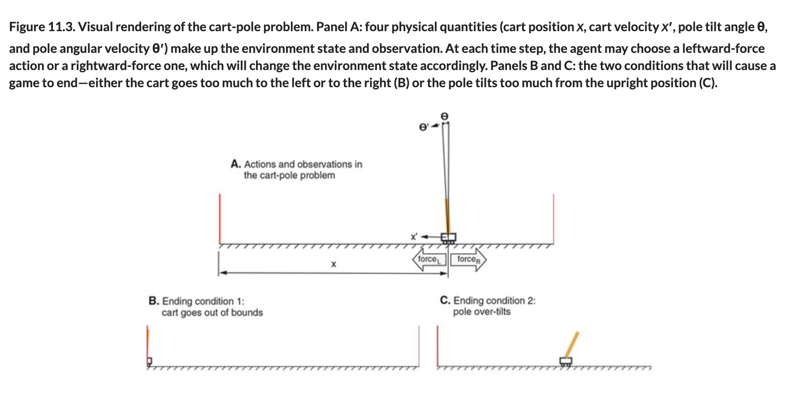

# 🟧 Cart Pole RL problems

## [**11.2.1.** Cart-pole as a reinforcement-learning problem](https://livebook.manning.com/book/deep-learning-with-javascript/chapter-11/29)

---

### [**Figure 11.3.** Visual rendering of the cart-pole problem.](https://livebook.manning.com/book/deep-learning-with-javascript/chapter-11/ch11fig03)

---

## **Vocabulary**

- <b>weights</b>

<link rel="stylesheet" type="text/css" media="all" href="../../../assets/css/custom.css" />

---

from [[_11-2-policy-networks-gradients]]

[//begin]: # "Autogenerated link references for markdown compatibility"
[_11-2-policy-networks-gradients]: _11-2-policy-networks-gradients.md "🟧 Policy Networks Gradients"
[//end]: # "Autogenerated link references"
