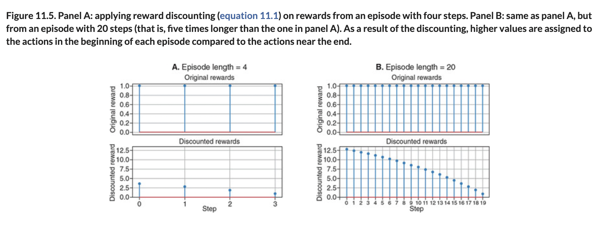

# 🟧 Policy Network

## [**11.2.2.** Policy network](https://livebook.manning.com/book/deep-learning-with-javascript/chapter-11/42)

---

### [**Figure 11.4.** How the policy network fits into our solution to the cart-pole problem.](https://livebook.manning.com/book/deep-learning-with-javascript/chapter-11/ch11fig04)

### [**Figure 11.5.** Panel A: applying reward discounting (equation 11.1) on rewards from an episode with four steps.](https://livebook.manning.com/book/deep-learning-with-javascript/chapter-11/ch11fig05)

### [Figure 11.6. Normalizing the discounted rewards from the two episodes with lengths 4 (panel A) and 20 (panel B).](https://livebook.manning.com/book/deep-learning-with-javascript/chapter-11/ch11fig06)

### [**Figure 11.7.** A curve showing the average number of steps the agent survives in the cart-pole episodes as a function of the number of training iterations.](https://livebook.manning.com/book/deep-learning-with-javascript/chapter-11/ch11fig07)

### [**Figure 11.8.** A schematic diagram illustrating the REINFORCE algorithm-based solution to the cart-pole problem.](https://livebook.manning.com/book/deep-learning-with-javascript/chapter-11/ch11fig08)

---

## **Vocabulary**

- <b>features</b>
- **vector**
- **binary classifier**
- **quality**
- **sigmoid function**
- **nonlinearity**
- **`tf.multinomial()`**
- **lstm-text-generation**
- **softmax**
- **`tf.sigmoid()`**
- **exploration versus exploitation**
- **`fitDataset()`**

<link rel="stylesheet" type="text/css" media="all" href="../../../assets/css/custom.css" />

---

from [[_11-2-policy-networks-gradients]]

[//begin]: # "Autogenerated link references for markdown compatibility"
[_11-2-policy-networks-gradients]: _11-2-policy-networks-gradients.md "🟧 Policy Networks Gradients"
[//end]: # "Autogenerated link references"
