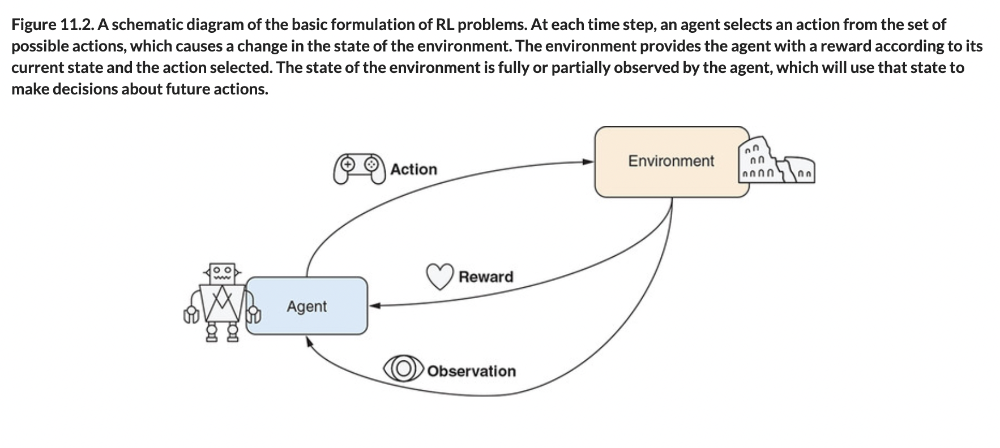

# 🟧 Policy Networks Gradients

## [**11.2.** Policy networks and policy gradients: The cart-pole example](https://livebook.manning.com/book/deep-learning-with-javascript/chapter-11/26)

---

### [**Figure 11.2.** A schematic diagram of the basic formulation of RL problems.](https://livebook.manning.com/book/deep-learning-with-javascript/chapter-11/ch11fig02)

---

## **Vocabulary**

- <b>cart-pole</b>
- <b>benchmark</b>
- <b>MNIST</b>

<link rel="stylesheet" type="text/css" media="all" href="../../../assets/css/custom.css" />

---

from [[_11_basics-deep-rl]]

[//begin]: # "Autogenerated link references for markdown compatibility"
[_11_basics-deep-rl]: ../_11_basics-deep-rl.md "🟧 Basics Reinforcement Learning"
[//end]: # "Autogenerated link references"
