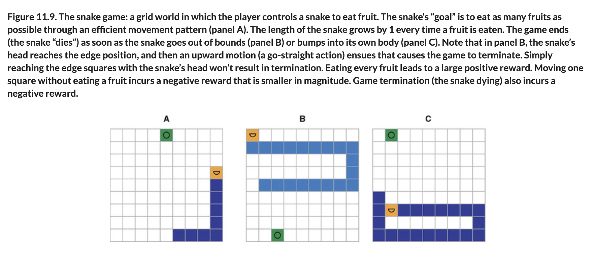
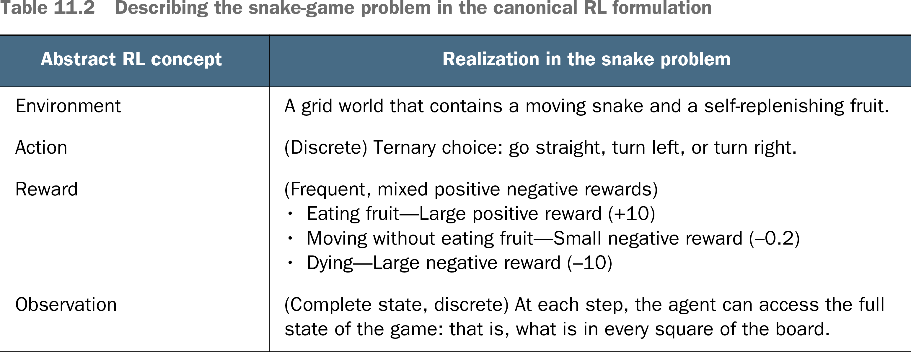

# 🟧 Snake Reinforce Learning

## [**11.3.1.** Snake as a reinforcement-learning problem](https://livebook.manning.com/book/deep-learning-with-javascript/chapter-11/94)

---

### [**Figure 11.9.** The snake game: a grid world in which the player controls a snake to eat fruit.](https://livebook.manning.com/book/deep-learning-with-javascript/chapter-11/ch11fig09)

---

## [**Table 11.2** Describing the snake-game problem in the canonical RL formulation](https://livebook.manning.com/book/deep-learning-with-javascript/chapter-11/ch11table02)

---

## **Vocabulary**

- <b>deep q-network</b>
- <b>representing the snakes mouth</b>
- <b>frames</b>
- <b>hyperparameters</b>

<link rel="stylesheet" type="text/css" media="all" href="../../../assets/css/custom.css" />

---

from [[_11-3-val-net-q-learn]]

[//begin]: # "Autogenerated link references for markdown compatibility"
[_11-3-val-net-q-learn]: _11-3-val-net-q-learn.md "🟧 Val Net Q Learn"
[//end]: # "Autogenerated link references"
