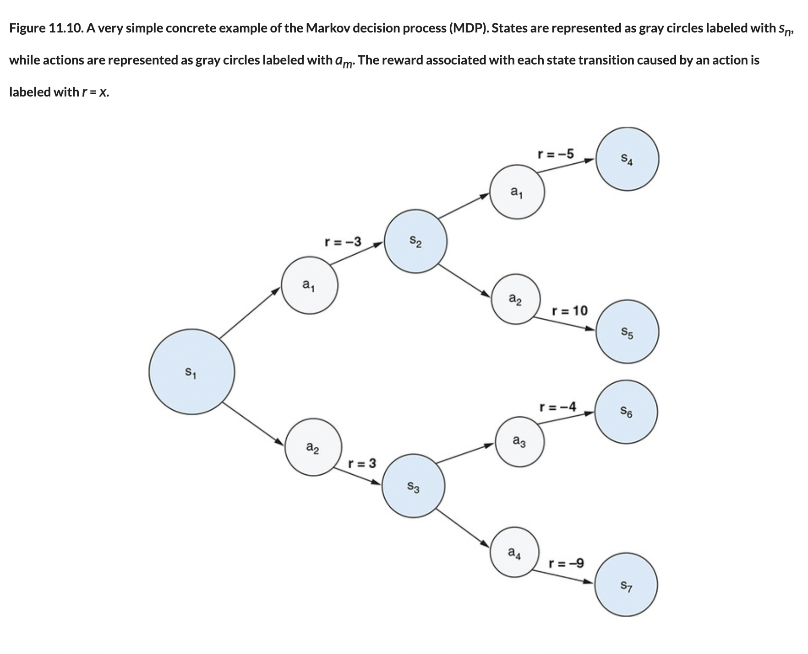

# 🟧 Markov Decision Process Q Values

## [**11.3.2.** Markov decision process and Q-values](https://livebook.manning.com/book/deep-learning-with-javascript/chapter-11/115)

---

### [**Figure 11.10.** A very simple concrete example of the Markov decision process (MDP).](https://livebook.manning.com/book/deep-learning-with-javascript/chapter-11/ch11fig10)

---

## **Vocabulary**

- <b>markov decision process (MDP)</b>
- <b>non-markov decision process</b>
- <b>conclusion</b>
- <b>bellman equation</b>

<link rel="stylesheet" type="text/css" media="all" href="../../../assets/css/custom.css" />

---

from [[_11-3-val-net-q-learn]]

[//begin]: # "Autogenerated link references for markdown compatibility"
[_11-3-val-net-q-learn]: _11-3-val-net-q-learn.md "🟧 Val Net Q Learn"
[//end]: # "Autogenerated link references"
