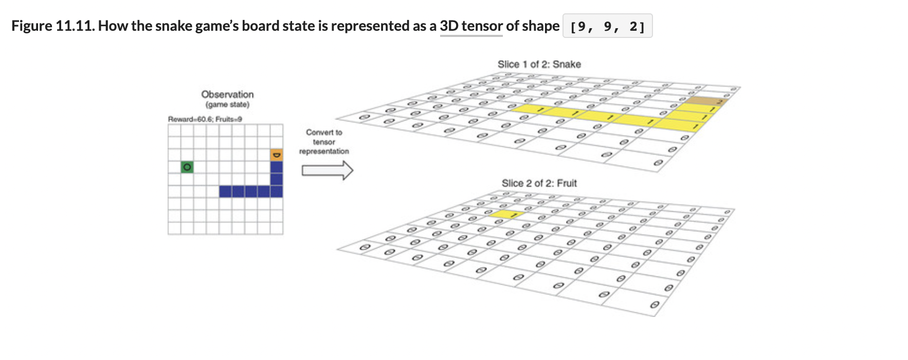
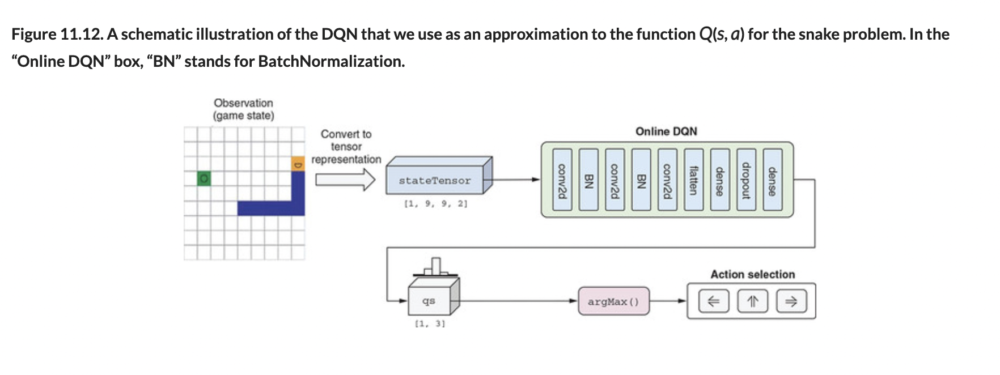

# 🟧 Deep Q Network

## [**11.3.3.** Deep Q-network](https://livebook.manning.com/book/deep-learning-with-javascript/chapter-11/146)

---

### [**Figure 11.11.** How the snake game’s board state is represented as a 3D tensor of shape [9, 9, 2]](https://livebook.manning.com/book/deep-learning-with-javascript/chapter-11/ch11fig11)

### [**Figure 11.12.** A schematic illustration of the DQN that we use as an approximation to the function Q(s, a) for the snake problem. In the “Online DQN” box, “BN” stands for BatchNormalization.](https://livebook.manning.com/book/deep-learning-with-javascript/chapter-11/ch11fig12)

---

## **Vocabulary**

- <b>tensor</b>
- <b>batch dimension</b>
- <b>`getStateTensor()`</b>
- <b>tensor buffer</b>
- <b>conv2d layers</b>

<link rel="stylesheet" type="text/css" media="all" href="../../../assets/css/custom.css" />

---

from [[_11-3-val-net-q-learn]]

[//begin]: # "Autogenerated link references for markdown compatibility"
[_11-3-val-net-q-learn]: _11-3-val-net-q-learn.md "🟧 Val Net Q Learn"
[//end]: # "Autogenerated link references"
