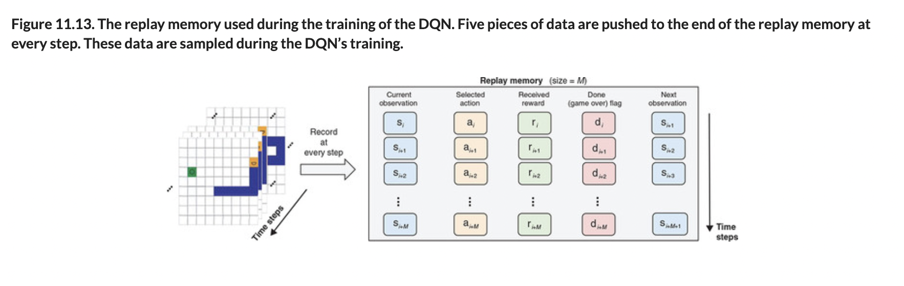
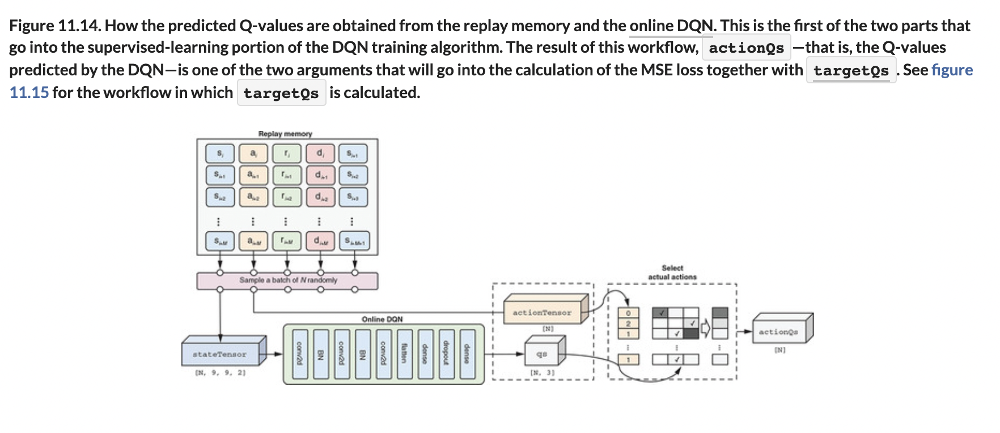
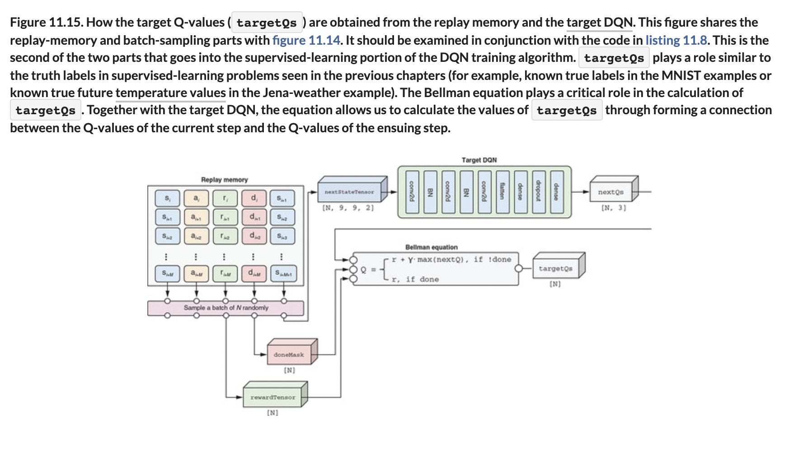
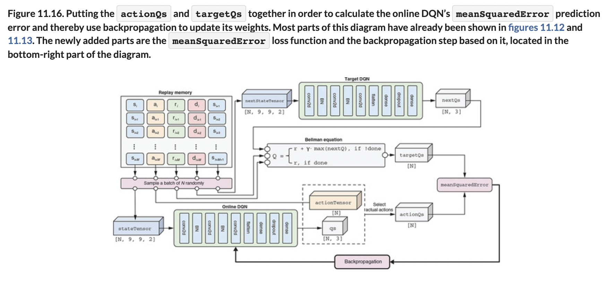
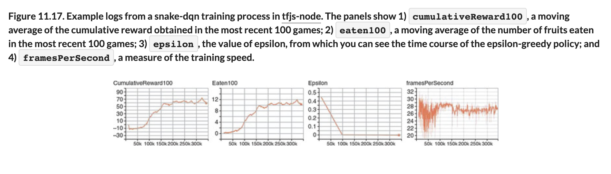
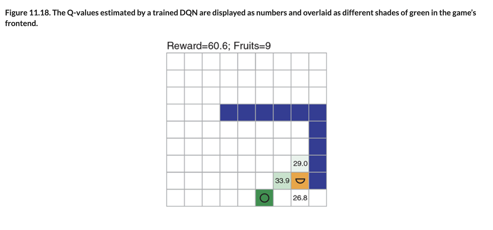
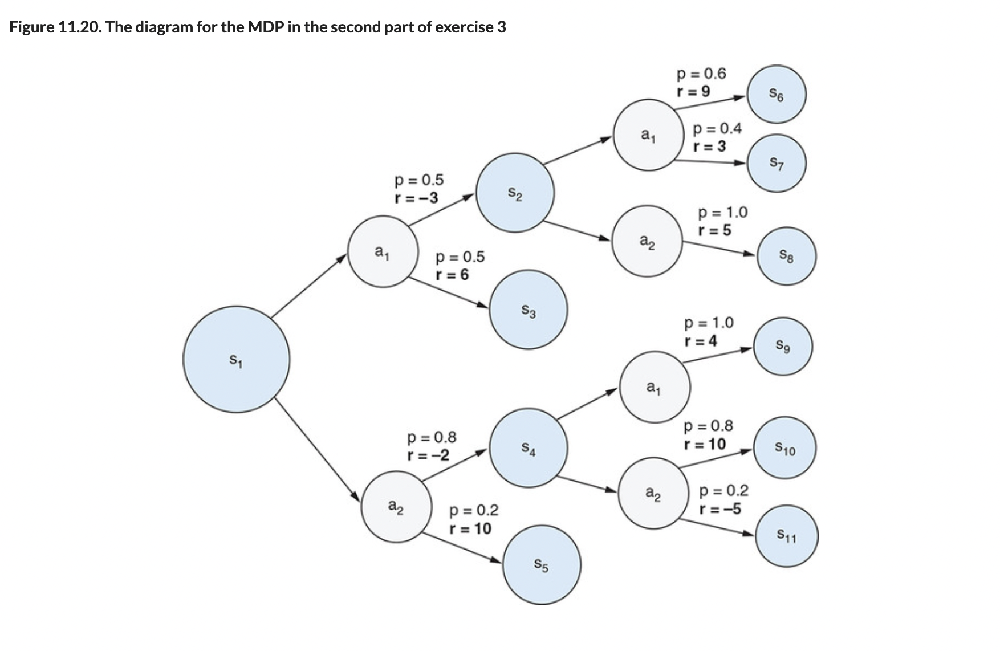

# 🟧 Training Deep Q Network

## [**11.3.4.** Training the deep Q-network](https://livebook.manning.com/book/deep-learning-with-javascript/chapter-11/146)

---

### [**Figure 11.13.** The replay memory used during the training of the DQN.](https://livebook.manning.com/book/deep-learning-with-javascript/chapter-11/ch11fig13)

### [**Figure 11.14.** How the predicted Q-values are obtained from the replay memory and the online DQN.](https://livebook.manning.com/book/deep-learning-with-javascript/chapter-11/ch11fig14)

### [**Figure 11.15.** How the target Q-values (targetQs) are obtained from the replay memory and the target DQN.](https://livebook.manning.com/book/deep-learning-with-javascript/chapter-11/ch11fig15)

### [**Figure 11.16.** Putting the actionQs and targetQs together in order to calculate the online DQN’s meanSquaredError prediction error and thereby use backpropagation to update its weights.](https://livebook.manning.com/book/deep-learning-with-javascript/chapter-11/ch11fig16)

### [**Figure 11.17.** Example logs from a snake-dqn training process in tfjs-node.](https://livebook.manning.com/book/deep-learning-with-javascript/chapter-11/ch11fig17)

### [**Figure 11.18.** The Q-values estimated by a trained DQN are displayed as numbers and overlaid as different shades of green in the game’s frontend.](https://livebook.manning.com/book/deep-learning-with-javascript/chapter-11/ch11fig18)

### [**Figure 11.19.** The diagram for the MDP in the first part of exercise 3](https://livebook.manning.com/book/deep-learning-with-javascript/chapter-11/ch11fig19)

### [**Figure 11.20.** The diagram for the MDP in the second part of exercise 3](https://livebook.manning.com/book/deep-learning-with-javascript/chapter-11/ch11fig20)

---

## **Vocabulary**

- **intuition**
- **backpropagation**
- **gradient descent**
- **replay memory**
- \*_rolling dataset_
- **`tf.LayersModel`**
- **`fitDataset()`**
- **epsilon-greedy algorithm**
- **`actionTensor`**
- **`createDeepQNetwork()`**
- **`meanSquaredError`**
- **`tf.variableGrads()`**
- **optimizer**
- **`targetQs`**

---

from [[_11-3-val-net-q-learn]]

[//begin]: # "Autogenerated link references for markdown compatibility"
[_11-3-val-net-q-learn]: _11-3-val-net-q-learn.md "🟧 Val Net Q Learn"
[//end]: # "Autogenerated link references"
