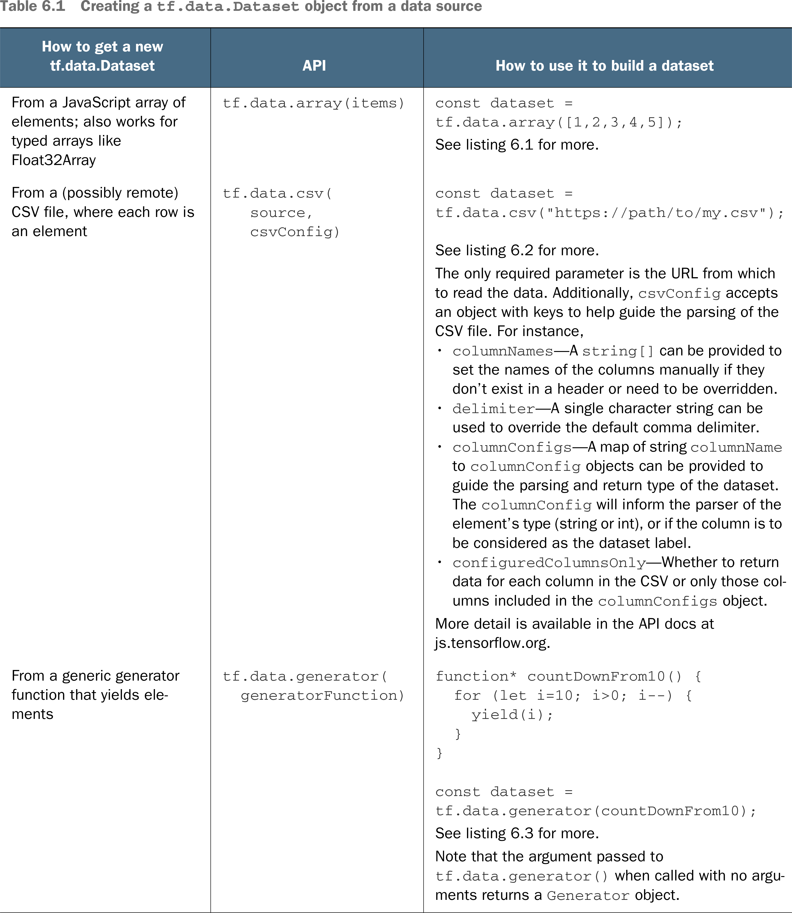

# 🧮 Create tf.data.Dataset

## [**6.1.2.** Creating a tf.data.Dataset](https://livebook.manning.com/book/deep-learning-with-javascript/chapter-6/20)

---

## **Vocabulary**

- <b>`tf.data.Dataset`</b>
- <b>`tf.data.array()`</b>
- <b>`model.fitDataset()`</b>
- <b>`model.evaluateDataset()`</b>
- <b>`forEachAsync()`</b>
- <b>`Dataset.forEachAsync`</b>
- <b>representing</b>
- <b>`tf.data.csv`</b>
- <b>`tf.data.generator()`</b>
- <b>generator function</b>
- <b>sequence</b>
- <b>myGeneratorDataset</b>
- <b>numPlaySoFar</b>
- <b>`tf.data.generator()`</b>

<link rel="stylesheet" type="text/css" media="all" href="../../../assets/css/custom.css" />

---

from [[_6-1-using-tf-data-to-manage-data]]

[//begin]: # "Autogenerated link references for markdown compatibility"
[_6-1-using-tf-data-to-manage-data]: _6-1-using-tf-data-to-manage-data.md "🧮 Manage with TF.data"
[//end]: # "Autogenerated link references"
