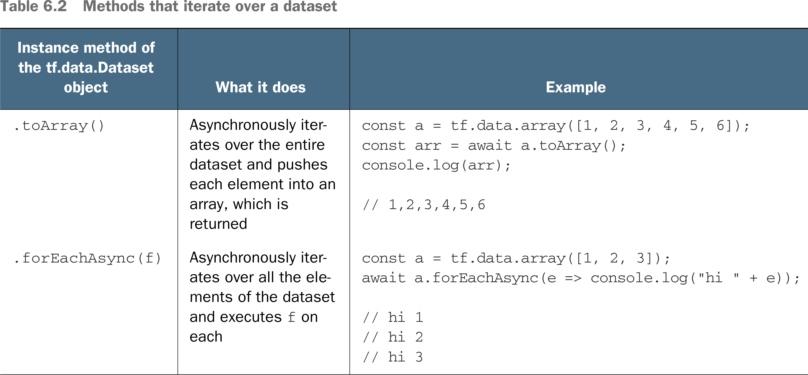

# 🧮 Accessing your Dataset

## [**6.1.3.** Accessing the data in your dataset](https://livebook.manning.com/book/deep-learning-with-javascript/chapter-6/53)

---

## [**Table 6.2** Methods that iterate over a dataset](https://livebook.manning.com/book/deep-learning-with-javascript/chapter-6/ch06table02)

---

## **Vocabulary**

- <b>`Dataset.toArray()`</b>
- <b>`dataset.forEachAsync(f)`</b>

<link rel="stylesheet" type="text/css" media="all" href="../../../assets/css/custom.css" />

---

from [[_6-1-using-tf-data-to-manage-data]]

[//begin]: # "Autogenerated link references for markdown compatibility"
[_6-1-using-tf-data-to-manage-data]: _6-1-using-tf-data-to-manage-data.md "🧮 Manage with TF.data"
[//end]: # "Autogenerated link references"
