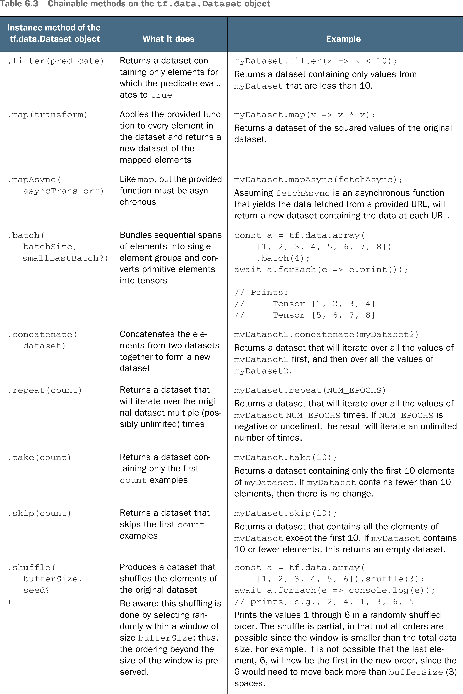

# 🧮 Manipulate TF.js datasets

## [**6.1.4.** Manipulating tfjs-data datasets](https://livebook.manning.com/book/deep-learning-with-javascript/chapter-6/60)

---

## [**Table 6.3** Chainable methods on the `tf.data.Dataset` object](https://livebook.manning.com/book/deep-learning-with-javascript/chapter-6/ch06table03)

---

## **Vocabulary**

- <b>tfjs-data datasets</b>
- <b>almost never</b>
- <b>`tf.data.Dataset`</b>
- <b>considerations</b>
- <b>training data</b>
- <b>`map()`</b>
- <b>`preprocessFn`</b>
- <b>`dataset.map()`</b>
- <b>`streaming normalization`</b>
- <b>limitations</b>
- <b>possibility</b>
- <b>`samplesSoFar`</b>

<link rel="stylesheet" type="text/css" media="all" href="../../../assets/css/custom.css" />

---

from [[_6-1-using-tf-data-to-manage-data]]

[//begin]: # "Autogenerated link references for markdown compatibility"
[_6-1-using-tf-data-to-manage-data]: _6-1-using-tf-data-to-manage-data.md "🧮 Manage with TF.data"
[//end]: # "Autogenerated link references"
