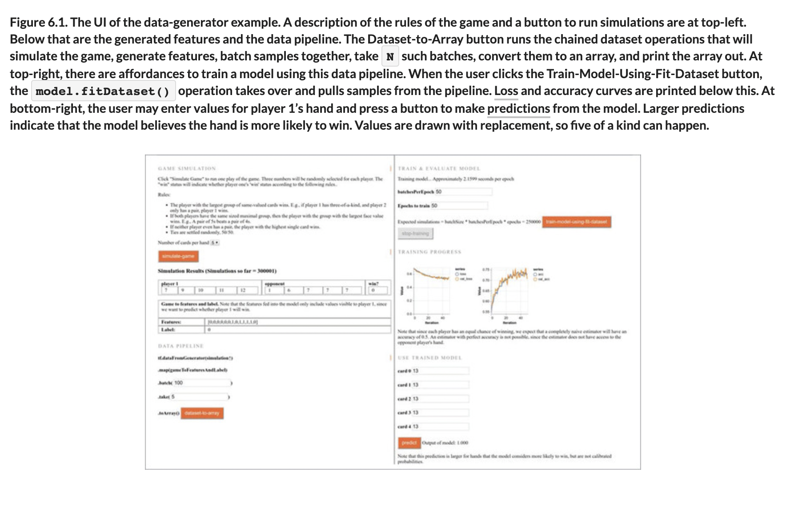
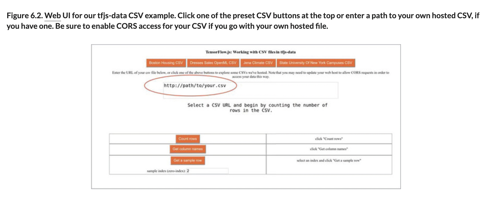

# 🧮 Training Models with Model Fit Dataset

## [**6.2.** Training models with model.fitDataset](https://livebook.manning.com/book/deep-learning-with-javascript/chapter-6/73)

---

### [**Figure 6.1.** The UI of the data-generator example.](https://livebook.manning.com/book/deep-learning-with-javascript/chapter-6/ch06fig01)

### [**Figure 6.2.** Web UI for our tfjs-data CSV example.](https://livebook.manning.com/book/deep-learning-with-javascript/chapter-6/ch06fig02)

---

## **Vocabulary**

- <b>`tf.data`</b>
- <b>`model.fit()`</b>
- <b>output</b>
- <b>batch size</b>
- <b>optimizer</b>
- <b>`model.fitDataset()`</b>
- <b>features</b>
- <b>accuracy</b>
- <b>`batchesPerEpoch`</b>
- <b>validationData</b>
- <b>validationBatches</b>

<link rel="stylesheet" type="text/css" media="all" href="../../../assets/css/custom.css" />

---

from [[_6_working-with-data]]

[//begin]: # "Autogenerated link references for markdown compatibility"
[_6_working-with-data]: ../_6_working-with-data.md "🧮 Working with Data"
[//end]: # "Autogenerated link references"
