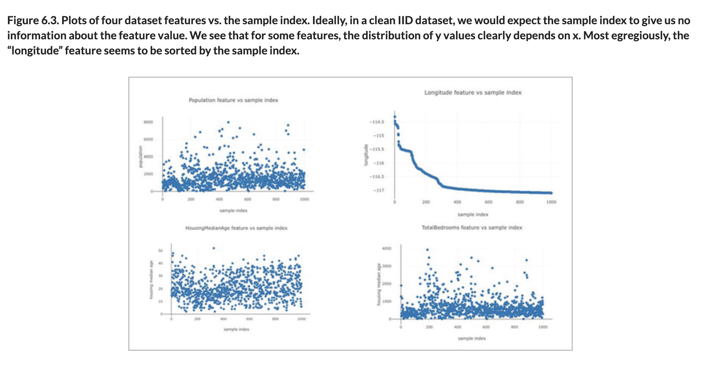
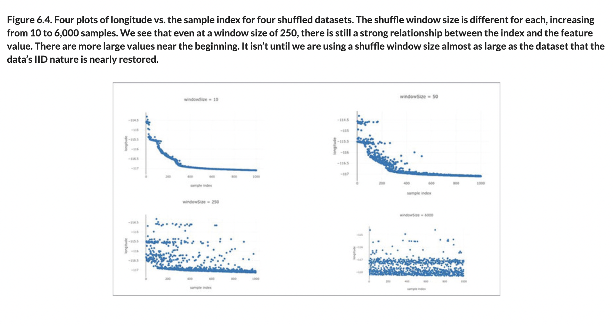

# 🧮 Theory of Data

## [**6.4.1.** Theory of data](https://livebook.manning.com/book/deep-learning-with-javascript/chapter-6/173)

---

### [**Figure 6.3.** Plots of four dataset features vs. the sample index.](https://livebook.manning.com/book/deep-learning-with-javascript/chapter-6/ch06fig03)

### [**Figure 6.4.** Four plots of longitude vs. the sample index for four shuffled datasets.](https://livebook.manning.com/book/deep-learning-with-javascript/chapter-6/ch06fig04)

---

## **Vocabulary**

- **bad data vs good data**
- **probability distribution**
- **formulation**
- **inference**
- **different distributions**
- **dataset skew**
- **independent and identically distributed**
- **`Plotly.js`**
- **train-test split**
- **streaming window**
- **`windowSize`**

<link rel="stylesheet" type="text/css" media="all" href="../../../assets/css/custom.css" />

---

from [[_6-4-dealing-width-flawed-data]]

[//begin]: # "Autogenerated link references for markdown compatibility"
[_6-4-dealing-width-flawed-data]: _6-4-dealing-width-flawed-data.md "🧮 Flawed Data dealing"
[//end]: # "Autogenerated link references"
