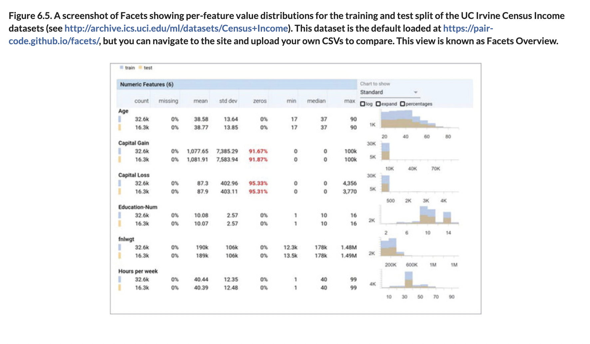
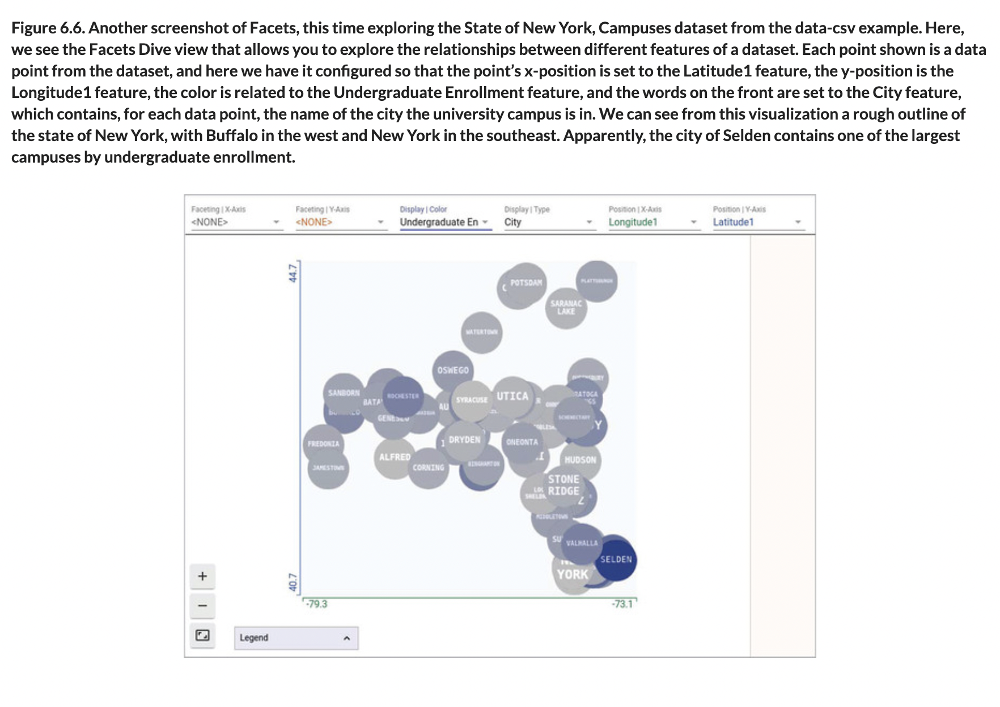

# 🧮 Detect Clean Data Problems

## [**6.4.2.** Detecting and cleaning problems with data](https://livebook.manning.com/book/deep-learning-with-javascript/chapter-6/191)

---

### [**Figure 6.5.** A screenshot of Facets showing per-feature value distributions for the training and test split of the UC Irvine Census Income datasets](https://livebook.manning.com/book/deep-learning-with-javascript/chapter-6/ch06fig05)

### [**Figure 6.6.** Another screenshot of Facets, this time exploring the State of New York, Campuses dataset](https://livebook.manning.com/book/deep-learning-with-javascript/chapter-6/ch06fig06)

---

## **Vocabulary**

- <b>outliers</b>
- <b>bias</b>
- <b>imputation</b>
- <b>categorical features</b>
- <b>sentinel value</b>
- <b>before clamping</b>
- <b>sentinel value</b>
- <b>`weight_missing`</b>
- <b>deploying</b>
- <b>simple way</b>
- <b>Facets</b>
- <b>algorithm</b>
- <b>categorical data</b>
- <b>deep-learning model</b>
- <b>word embeddings</b>
- <b>unbalanced data</b>
- <b>numeric/categorical distinction</b>
- <b>means encoding</b>
- <b>one-hot embedding</b>
- <b>scale differences</b>

<link rel="stylesheet" type="text/css" media="all" href="../../../assets/css/custom.css" />

---

from [[_6-4-dealing-width-flawed-data]]

[//begin]: # "Autogenerated link references for markdown compatibility"
[_6-4-dealing-width-flawed-data]: _6-4-dealing-width-flawed-data.md "🧮 Flawed Data dealing"
[//end]: # "Autogenerated link references"
