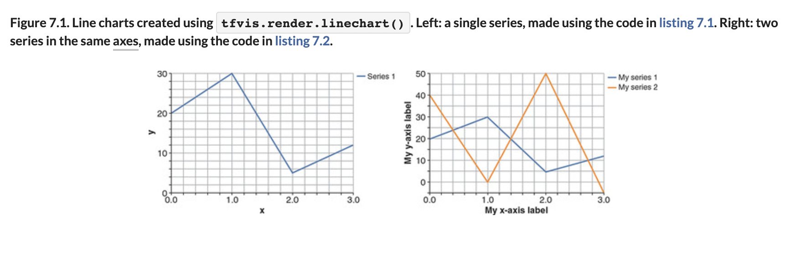
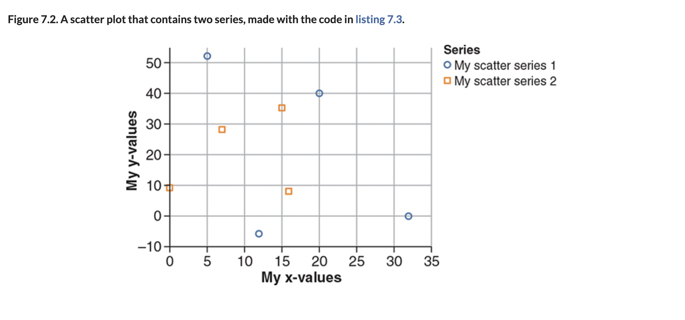
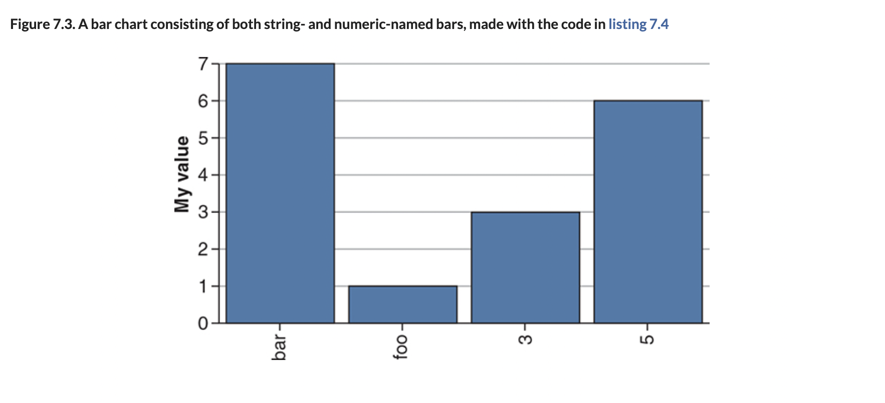
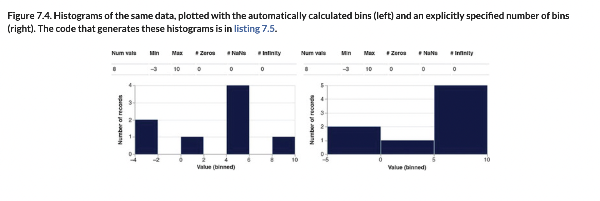
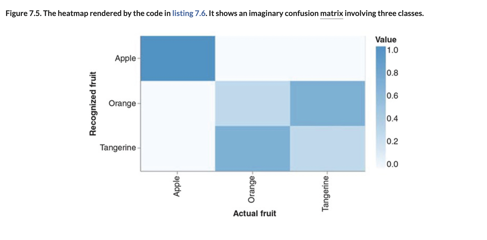

# 👁 Viz TF.js

## [**7.1.1.** Visualizing data using tfjs-vis](https://livebook.manning.com/book/deep-learning-with-javascript/chapter-7/9)

---

### [**Figure 7.1.** Line charts created using tfvis.render.linechart().](https://livebook.manning.com/book/deep-learning-with-javascript/chapter-7/ch07fig01)

### [Figure 7.2. A scatter plot that contains two series, made with the code in listing 7.3.](https://livebook.manning.com/book/deep-learning-with-javascript/chapter-7/ch07fig02)

### [**Figure 7.3.** A bar chart consisting of both string- and numeric-named bars, made with the code in listing 7.4](https://livebook.manning.com/book/deep-learning-with-javascript/chapter-7/ch07fig03)

### [**Figure 7.4.** Histograms of the same data, plotted with the automatically](https://livebook.manning.com/book/deep-learning-with-javascript/chapter-7/ch07fig04)

### [**Figure 7.5.** The heatmap rendered by the code in listing 7.6.](https://livebook.manning.com/book/deep-learning-with-javascript/chapter-7/ch07fig05)

---

## **Vocabulary**

- <b>features</b>
- <b>`tfvis.render.*`</b>
- <b>`@tensorflow/tfjs-vis`</b>
- <b>`@tensorflow/tfjs`</b>
- <b>`y-axis`</b>
- <b>temperature</b>
- <b>ROC</b>
- <b>binary classifier</b>
- <b>`linechart()`</b>
- <b>scatter plots</b>
- <b>`scatterplot()`</b>
- <b>bar charts</b>
- <b>`barchart()`</b>
- <b>histograms</b>
- <b>distributions</b>
- <b>bins</b>
- <b>`tfvis.render.histogram()`</b>
- <b>`histograms()`</b>
- <b>heatmaps</b>
- <b>confusion matrix</b>

<link rel="stylesheet" type="text/css" media="all" href="../../../assets/css/custom.css" />

---

from [[_7-1-data-viz]]

[//begin]: # "Autogenerated link references for markdown compatibility"
[_7-1-data-viz]: _7-1-data-viz.md "7.1 👁 Data Viz"
[//end]: # "Autogenerated link references"
