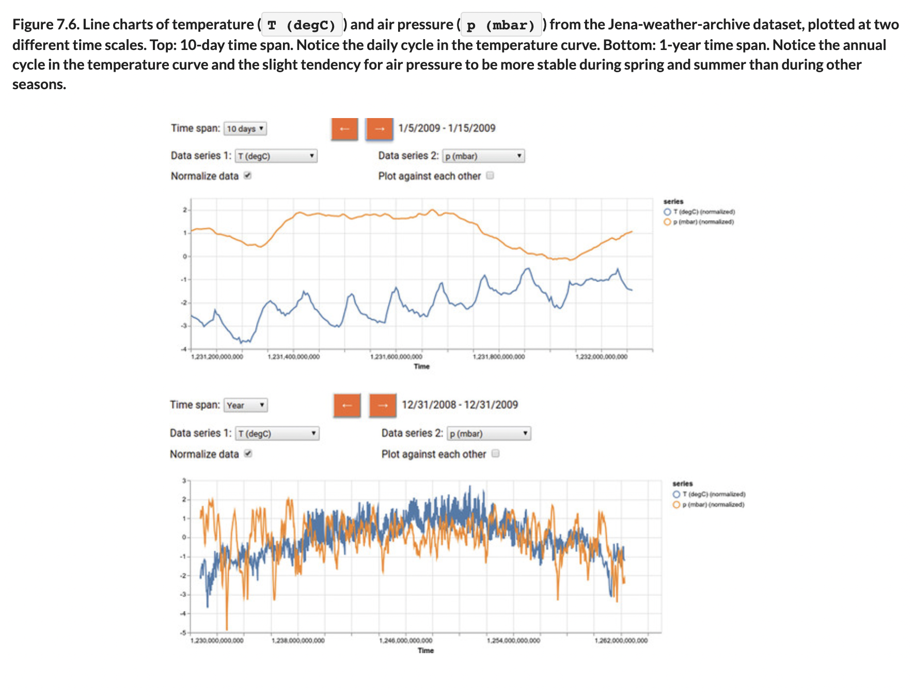
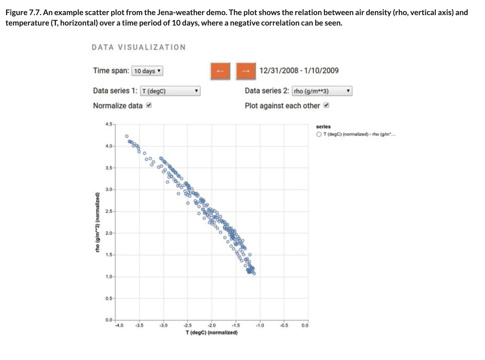

# 👁 Weather TF.js Viz

## [**7.1.2.** An integrative case study: Visualizing weather data with tfjs-vis](https://livebook.manning.com/book/deep-learning-with-javascript/chapter-7/60)

---

### [**Figure 7.6.** Line charts of temperature (T (degC)) and air pressure (p (mbar)) from the Jena-weather-archive dataset, plotted at two different time scales.](https://livebook.manning.com/book/deep-learning-with-javascript/chapter-7/ch07fig06)

### [**Figure 7.7.** An example scatter plot from the Jena-weather demo.](https://livebook.manning.com/book/deep-learning-with-javascript/chapter-7/ch07fig07)

---

## **Vocabulary**

- <b>integrative case study</b>
- <b>visualizing weather data</b>

<link rel="stylesheet" type="text/css" media="all" href="../../../assets/css/custom.css" />

---

from [[_7-1-data-viz]]

[//begin]: # "Autogenerated link references for markdown compatibility"
[_7-1-data-viz]: _7-1-data-viz.md "7.1 👁 Data Viz"
[//end]: # "Autogenerated link references"
