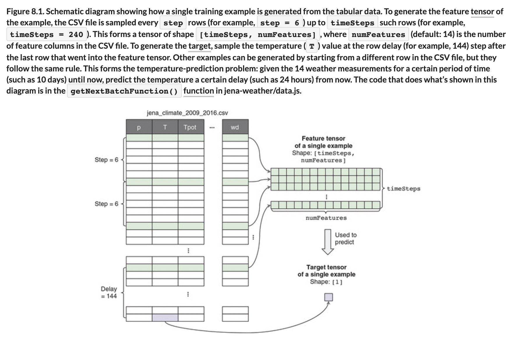

# 💧 Temp Predict

## [**8.1** Formulation of the temperature-prediction problem](https://livebook.manning.com/book/deep-learning-with-javascript/chapter-8/6)

---

## [**Figure 8.1.** Schematic diagram showing how a single training example is generated from the tabular data.](https://livebook.manning.com/book/deep-learning-with-javascript/chapter-8/ch08fig01)

---

## **Vocabulary**

- <b>temperature-prediction</b>
- <b>intuition</b>
- <b>training data</b>
- <b>`timeSteps`</b>
- <b>`numFeatures`</b>
- <b>`batchSteps`</b>
- <b>sequence</b>
- <b>spectrogram</b>
- <b>sequential input data</b>
- <b>RNNs</b>
- <b>`getNextBatchFunction()`</b>
- <b>`next()`</b>
- <b>`tf.data.generator`</b>
- <b>`customCallback`</b>
- <b>visitor surface</b>
- <b>`fitCallbacks()`</b>

<link rel="stylesheet" type="text/css" media="all" href="../../../assets/css/custom.css" />

---

from [[_8_under-over-fitting-ml-workflow]]

[//begin]: # "Autogenerated link references for markdown compatibility"
[_8_under-over-fitting-ml-workflow]: ../_8_under-over-fitting-ml-workflow.md "💧 Under Over Fitting ML Workflow"
[//end]: # "Autogenerated link references"
