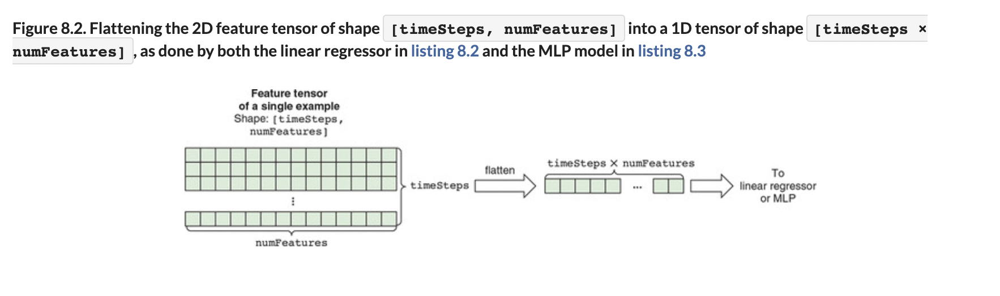
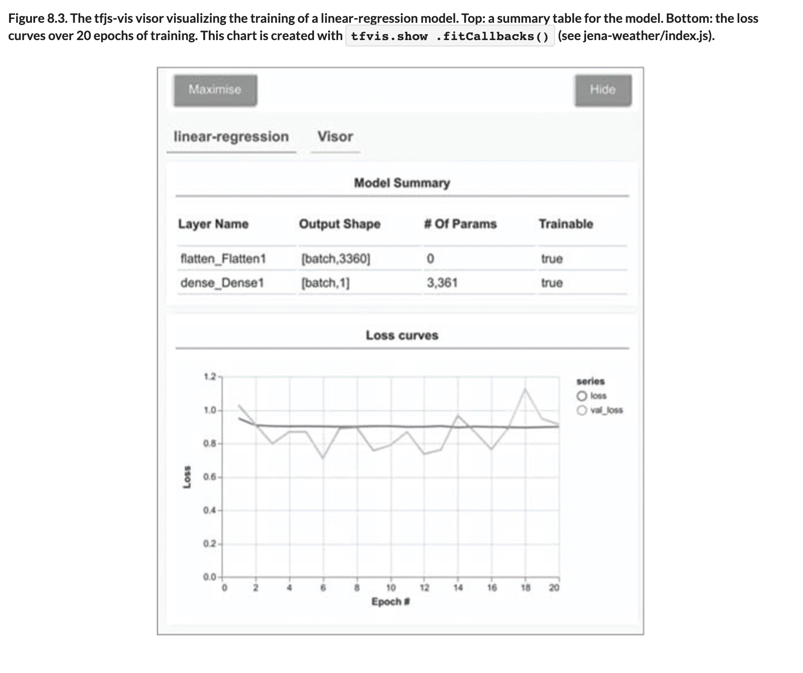

# 💧 Underfitting

## [**8.2.1.** Underfitting](https://livebook.manning.com/book/deep-learning-with-javascript/chapter-8/30)

---

## [**Figure 8.2.** Flattening the 2D feature tensor of shape [timeSteps, numFeatures] into a 1D tensor of shape [timeSteps × numFeatures]](https://livebook.manning.com/book/deep-learning-with-javascript/chapter-8/ch08fig02)

## [**Figure 8.3.** The tfjs-vis visor visualizing the training of a linear-regression model.](https://livebook.manning.com/book/deep-learning-with-javascript/chapter-8/ch08fig03)

---

## **Vocabulary**

- <b>dense layer</b>
- <b>activation to generate the prediction</b>
- <b>linear regression</b>
- <b>loss function</b>
- <b>`meanAbsoluteError`</b>
- <b>normalized</b>
- <b>Regression</b>
- <b>text-output</b>
- <b>`tfvis.show.modelSummary()`</b>
- <b>`fitCallbacks()`</b>
- <b>recall</b>

<link rel="stylesheet" type="text/css" media="all" href="../../../assets/css/custom.css" />

---

from [[_8-2-under-over-fitting-countermeasures]]

[//begin]: # "Autogenerated link references for markdown compatibility"
[_8-2-under-over-fitting-countermeasures]: _8-2-under-over-fitting-countermeasures.md "💧 Under Over Fit Counter Measures"
[//end]: # "Autogenerated link references"
