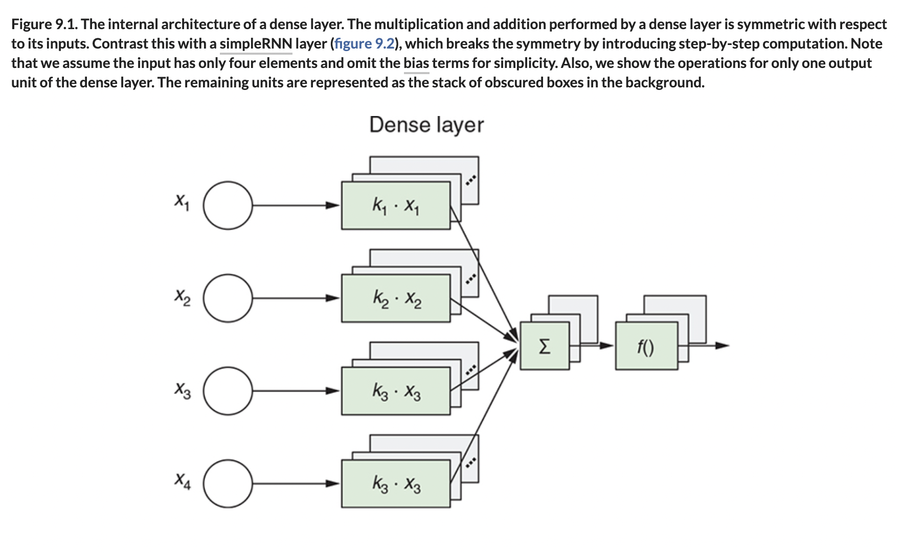

# 🧬 Why Dense Layers Fail Feq Order

## [**9.1.1.** Why dense layers fail to model sequential order](https://livebook.manning.com/book/deep-learning-with-javascript/chapter-9/16)

---

### [**Figure 9.1.** The internal architecture of a dense layer.](https://livebook.manning.com/book/deep-learning-with-javascript/chapter-9/ch09fig01)

---

## **Vocabulary**

- **dense layers**
- **sequential order**
- **dataset**
- **temperature**
- **training time**
- **`tf.layers.flatten`**
- **inference**
- **output**
- **regularization**
- **accuracy**
- **algorithms**
- **`getBaselineMeanAbsoluteError()`**
- **observations**
- **machine learning**
- **hyperparameter**

---

from [[_9-1-weather-predict-rnns]]

[//begin]: # "Autogenerated link references for markdown compatibility"
[_9-1-weather-predict-rnns]: _9-1-weather-predict-rnns.md "🧬 Weather: Intro RNNs"
[//end]: # "Autogenerated link references"
