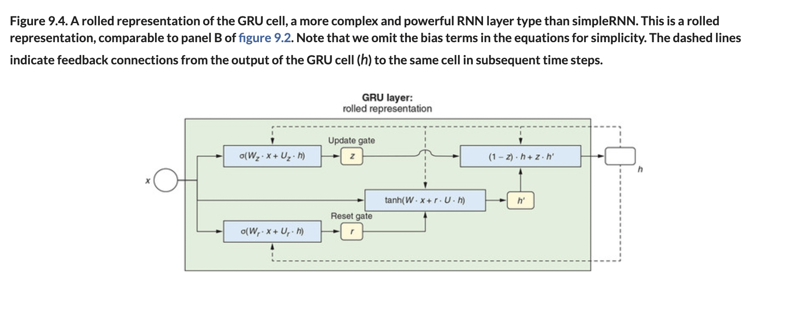

# 🧬 How RNNs Model Seq Order

## [**9.1.2.** How RNNs model sequential order](https://livebook.manning.com/book/deep-learning-with-javascript/chapter-9/31)

---

### [**Figure 9.2.** The “unrolled” (panel A) and “rolled” (panel B) representations of the internal structure of simpleRNN.](https://livebook.manning.com/book/deep-learning-with-javascript/chapter-9/ch09fig02)

### [**Figure 9.3.** MAE loss curves from the simpleRNN model built for the Jena-temperature-prediction problem.](https://livebook.manning.com/book/deep-learning-with-javascript/chapter-9/ch09fig03)

### [**Figure 9.4.** A rolled representation of the GRU cell, a more complex and powerful RNN layer type than simpleRNN.](https://livebook.manning.com/book/deep-learning-with-javascript/chapter-9/ch09fig04)

### [**Figure 9.5.** The loss curves from training a GRU model on the temperature-prediction problem.](https://livebook.manning.com/book/deep-learning-with-javascript/chapter-9/ch09fig05)

---

## **Vocabulary**

- **`tf.layers.simpleRNN()`**
- **feedforward layers**
- **conv2d**
- **rolled**
- **flattening**
- **weight parameters**
- **parameter sharing**
- **time dimension**
- **gradient**
- **recurrent network**
- **graph**
- **backpropagation through time (bptt)**
- **activation**
- **batch dimension**
- **sequence data**
- **parallelization**
- **LSTM**
- **vanishing gradient problem**
- **reset gate**
- **image input**
- **hypothesis space**

<link rel="stylesheet" type="text/css" media="all" href="../../../assets/css/custom.css" />

---

from [[_9-1-weather-predict-rnns]]

[//begin]: # "Autogenerated link references for markdown compatibility"
[_9-1-weather-predict-rnns]: _9-1-weather-predict-rnns.md "🧬 Weather: Intro RNNs"
[//end]: # "Autogenerated link references"
