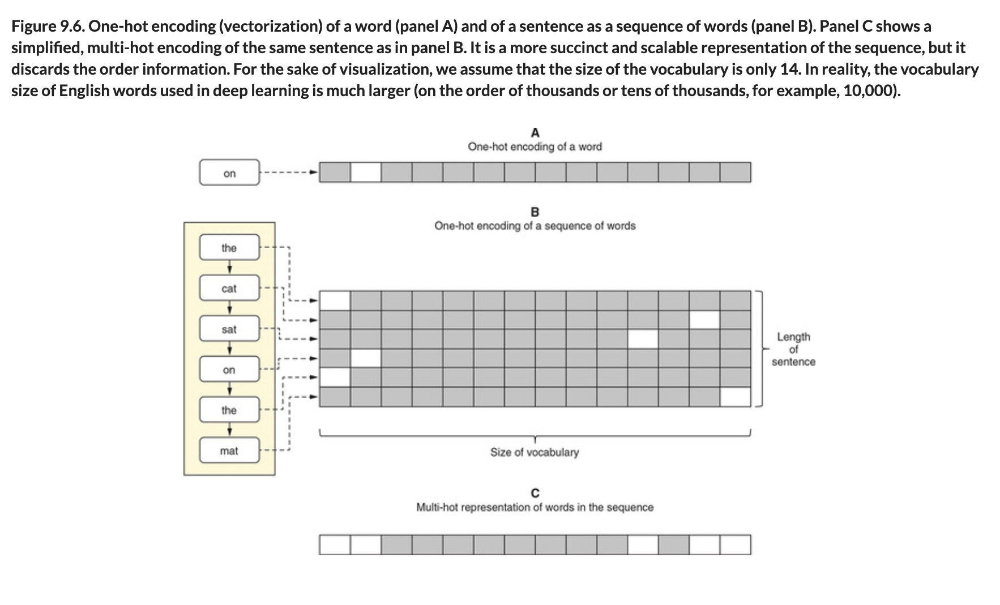

# 🧬 Text One Multi Hot Encoding

## [**9.2.1.** How text is represented in machine learning: One-hot and multi-hot encoding](https://livebook.manning.com/book/deep-learning-with-javascript/chapter-9/98)

---

### [**Figure 9.6.** One-hot encoding (vectorization) of a word (panel A) and of a sentence as a sequence of words (panel B).](https://livebook.manning.com/book/deep-learning-with-javascript/chapter-9/ch09fig06)

---

## **Vocabulary**

- <b>multiclass classification</b>
- <b>MobileNet</b>
- <b>text vectorization</b>
- <b>one-hot encoding</b>
- <b>out-of vocabulary (OOV)</b>
- <b>embedding vector</b>
- <b>one-hot vectors</b>
- <b>multi-hot encoding</b>

<link rel="stylesheet" type="text/css" media="all" href="../../../assets/css/custom.css" />

---

from [[_9-2-build-deep-learn-models-for-text]]

[//begin]: # "Autogenerated link references for markdown compatibility"
[_9-2-build-deep-learn-models-for-text]: _9-2-build-deep-learn-models-for-text.md "🧬 Text Deep Learn Models"
[//end]: # "Autogenerated link references"
