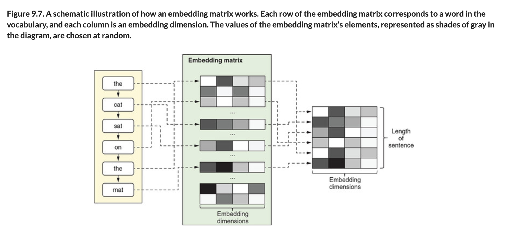
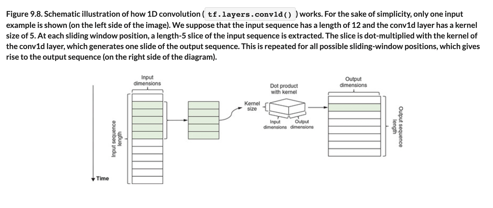

# 🧬 Word Embeddings

## [**9.2.3.** A more efficient representation of text: Word embeddings](https://livebook.manning.com/book/deep-learning-with-javascript/chapter-9/117)

---

### [**Figure 9.7.** A schematic illustration of how an embedding matrix works.](https://livebook.manning.com/book/deep-learning-with-javascript/chapter-9/ch09fig07)

### [**Figure 9.8.** Schematic illustration of how 1D convolution (tf.layers.conv1d()) works.](https://livebook.manning.com/book/deep-learning-with-javascript/chapter-9/ch09fig08)

---

## **Vocabulary**

- **word embedding**
- **matrix shape**
- **`vocabularySize`**
- **`embeddingDims`**
- **`sequenceLength`**
- **`tf.gather()`**
- **classification result**

---

from [[_9-2-build-deep-learn-models-for-text]]

[//begin]: # "Autogenerated link references for markdown compatibility"
[_9-2-build-deep-learn-models-for-text]: _9-2-build-deep-learn-models-for-text.md "🧬 Text Deep Learn Models"
[//end]: # "Autogenerated link references"
