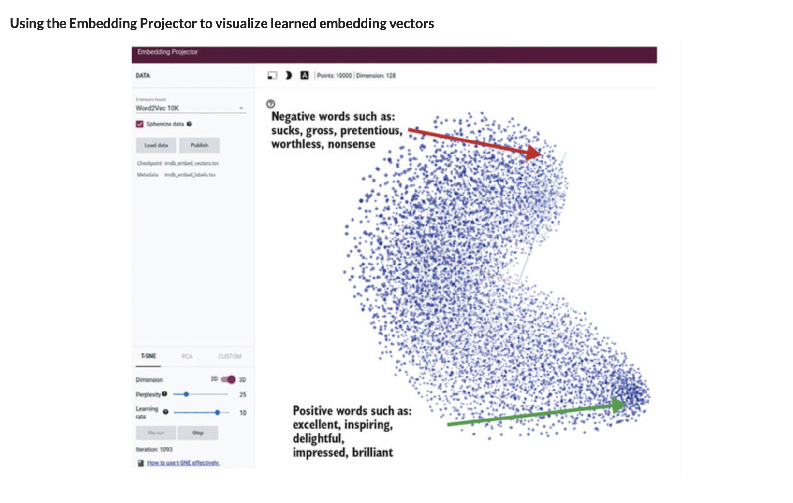

# 🧬 Seq-to-Seq Task

## [**9.3.1.** Formulation of the sequence-to-sequence task](https://livebook.manning.com/book/deep-learning-with-javascript/chapter-9/186)

---

### [**Figure 9.9.** The attention-based encoder-decoder for date conversion at work, with the attention matrix for the particular input-output pair displayed at the bottom-right](https://livebook.manning.com/book/deep-learning-with-javascript/chapter-9/ch09fig09)

---

## **Vocabulary**

- **encode-decoder architecture**
- **trained model**
- **heatmap**

<link rel="stylesheet" type="text/css" media="all" href="../../../assets/css/custom.css" />

---

from [[_9-3-seq-to-seq-task-attn-mechanism]]

[//begin]: # "Autogenerated link references for markdown compatibility"
[_9-3-seq-to-seq-task-attn-mechanism]: _9-3-seq-to-seq-task-attn-mechanism.md "🧬 Seq-to-seq Attn Mechanism"
[//end]: # "Autogenerated link references"
