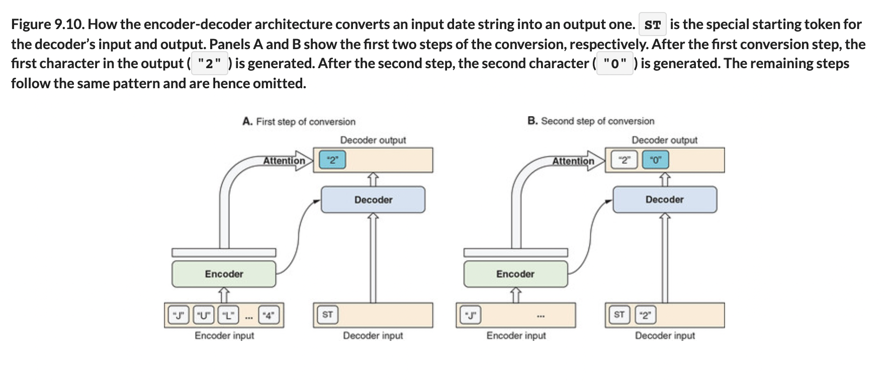

# 🧬 En-De-Coders Attn Mechanisms

## [**9.3.2.** The encoder-decoder architecture and the attention mechanism](https://livebook.manning.com/book/deep-learning-with-javascript/chapter-9/202)

---

### [**Figure 9.10.** How the encoder-decoder architecture converts an input date string into an output one.](https://livebook.manning.com/book/deep-learning-with-javascript/chapter-9/ch09fig10)

---

## **Vocabulary**

- <b>regression</b>
- <b>classification</b>
- <b>encoder</b>
- <b>decoder</b>
- <b>training phase</b>
- <b>`Model.predict()`</b>
- <b>`runSeq2SeqInference()`</b>
- <b>introduction</b>
- <b>access</b>
- <b>sounds</b>

<link rel="stylesheet" type="text/css" media="all" href="../../../assets/css/custom.css" />

---

from [[_9-3-seq-to-seq-task-attn-mechanism]]

[//begin]: # "Autogenerated link references for markdown compatibility"
[_9-3-seq-to-seq-task-attn-mechanism]: _9-3-seq-to-seq-task-attn-mechanism.md "🧬 Seq-to-seq Attn Mechanism"
[//end]: # "Autogenerated link references"
