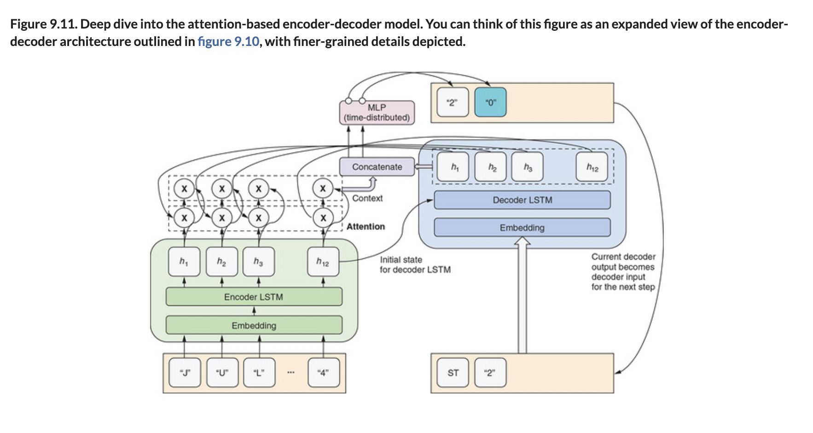

# 🧬 Attn Based Enc-Dec Model

## [**9.3.3.** Deep dive into the attention-based encoder-decoder model](https://livebook.manning.com/book/deep-learning-with-javascript/chapter-9/218)

---

### [**Figure 9.11.** Deep dive into the attention-based encoder-decoder model.](https://livebook.manning.com/book/deep-learning-with-javascript/chapter-9/ch09fig11)

---

## **Vocabulary**

- **deep-dive**
- **attention-based encode-decoder model**
- **`createModel()`**
- **`maskZero: true`**
- **`returnSequences: true`**
- **`GetLastTimestepLayer`**
- **symbolic tensor**
- \*_`encoderLast`_
- **softmax**
- **`decoderCombinedContext`**
- **`timeDistributed layer`**
- **`categorical cross-entropy`**
- **`argMax()`**
- **`dateTupleToMMMSpaceDDSpaceYY()`**

<link rel="stylesheet" type="text/css" media="all" href="../../../assets/css/custom.css" />

---

from [[_9-3-seq-to-seq-task-attn-mechanism]]

[//begin]: # "Autogenerated link references for markdown compatibility"
[_9-3-seq-to-seq-task-attn-mechanism]: _9-3-seq-to-seq-task-attn-mechanism.md "🧬 Seq-to-seq Attn Mechanism"
[//end]: # "Autogenerated link references"
